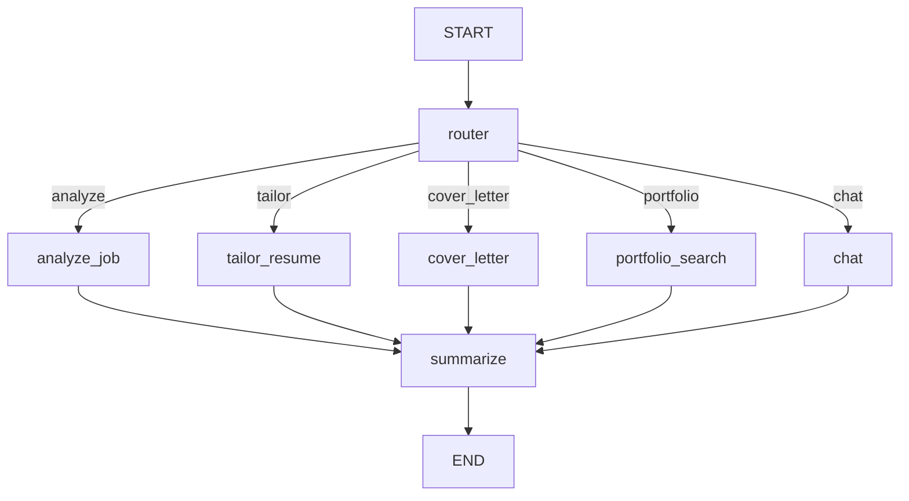

# Resume Agent LangGraph - Implementation Checklist

**Goal:** Transform the basic conversational agent into a production-ready Resume Agent with job analysis, resume tailoring, cover letter generation, and portfolio search capabilities.

**Architecture:** Multi-workflow LangGraph agent with state management, conditional routing, and persistent checkpointing.

---

## Table of Contents

- [Overview](#overview)
- [Reference Files](#reference-files)
- [Implementation Phases](#implementation-phases)
  - [Phase 1: Foundation & Setup](#phase-1-foundation--setup)
  - [Phase 2: State Schema Design](#phase-2-state-schema-design)
  - [Phase 3: Data Access Layer](#phase-3-data-access-layer)
  - [Phase 4: Job Analysis Workflow](#phase-4-job-analysis-workflow)
  - [Phase 5: Resume Tailoring Workflow](#phase-5-resume-tailoring-workflow)
  - [Phase 6: Cover Letter Generation](#phase-6-cover-letter-generation)
  - [Phase 7: Portfolio Search Integration](#phase-7-portfolio-search-integration)
  - [Phase 8: Conversational Orchestrator](#phase-8-conversational-orchestrator)
  - [Phase 9: Error Handling & Validation](#phase-9-error-handling--validation)
  - [Phase 10: Graph Assembly](#phase-10-graph-assembly)
  - [Phase 11: Persistence & Checkpointing](#phase-11-persistence--checkpointing)
  - [Phase 12: FastAPI Server Integration](#phase-12-fastapi-server-integration)
  - [Phase 13: Agent Chat UI Testing](#phase-13-agent-chat-ui-testing)
  - [Phase 14: Documentation & Examples](#phase-14-documentation--examples)
  - [Phase 15: Testing & Quality Assurance](#phase-15-testing--quality-assurance)
- [Key Patterns & Code Snippets](#key-patterns--code-snippets)
- [Testing Strategy](#testing-strategy)

---

## Overall Progress

**Last Updated**: 2025-10-26

### Phase Completion Status

| Phase | Status | Progress | Completion Date |
|-------|--------|----------|-----------------|
| **Phase 1**: Foundation & Setup | ✅ Complete | 14/14 (100%) | 2025-10-26 |
| **Phase 2**: State Schema Design | ✅ Complete | 3/3 (100%) | 2025-10-26 |
| **Phase 3**: Data Access Layer | ⚪ Not Started | 0/5 (0%) | - |
| **Phase 4**: Job Analysis Workflow | ⚪ Not Started | 0/7 (0%) | - |
| **Phase 5**: Resume Tailoring Workflow | ⚪ Not Started | 0/6 (0%) | - |
| **Phase 6**: Cover Letter Generation | ⚪ Not Started | 0/5 (0%) | - |
| **Phase 7**: Portfolio Search Integration | ⚪ Not Started | 0/5 (0%) | - |
| **Phase 8**: Conversational Orchestrator | ⚪ Not Started | 0/5 (0%) | - |
| **Phase 9**: Error Handling & Validation | ⚪ Not Started | 0/4 (0%) | - |
| **Phase 10**: Graph Assembly | ⚪ Not Started | 0/5 (0%) | - |
| **Phase 11**: Persistence & Checkpointing | ⚪ Not Started | 0/4 (0%) | - |
| **Phase 12**: FastAPI Server Integration | ⚪ Not Started | 0/4 (0%) | - |
| **Phase 13**: Agent Chat UI Testing | ⚪ Not Started | 0/6 (0%) | - |
| **Phase 14**: Documentation & Examples | ⚪ Not Started | 0/4 (0%) | - |
| **Phase 15**: Testing & Quality Assurance | ⚪ Not Started | 0/5 (0%) | - |

**Overall Progress**: 2/15 phases complete (13%)

### Recent Completions

- ✅ **Phase 1: Foundation & Setup** (2025-10-26)
  - Inventoried 30 MCP tools across 6 categories
  - Documented database schema (13+ tables)
  - Mapped data flows and workflows
  - Created MCP vs LangGraph comparison
  - Defined checkpointing strategy
  - Answered all architecture questions
  - 7 comprehensive documentation files created (~4,000 lines)

- ✅ **Phase 2: State Schema Design** (2025-10-26)
  - Created complete TypedDict-based state schema
  - Implemented custom reducers (append_unique_examples, replace_with_latest)
  - Added 13 state fields, 9 data structures, 4 validators
  - Comprehensive documentation in `docs/state-schema.md`

### Current Focus

**Phase 3**: Data Access Layer (Next)
- Create data loading functions
- Wrap MCP server data access
- Test state initialization with real data

---

## Overview

This checklist guides you through building a LangGraph-based Resume Agent that matches the functionality of the existing MCP server (`apps/resume-agent/resume_agent.py`).

### Learning Objectives

- Master LangGraph state management with TypedDict and reducers
- Implement conditional routing and multi-workflow orchestration
- Integrate LLM reasoning with data persistence
- Build production-ready error handling and validation
- Deploy with FastAPI SSE streaming for real-time UX

### Current State vs Target State

**Current:** Basic conversational agent with OpenAI/Claude integration
- File: `resume_agent_langgraph.py`
- Features: Simple chat, memory checkpointing
- State: `ConversationState` with messages only

**Target:** Full-featured career application assistant
- Features: Job analysis, resume tailoring, cover letters, portfolio search
- State: `ResumeAgentState` with job data, documents, and conversation context
- Workflows: 5 distinct workflows with intelligent routing

---

## Reference Files

### Essential Reading

1. **Feature Specification**
   - `apps/resume-agent/resume_agent.py` - All features implemented as MCP tools
   - Reference this for business logic and data structures

2. **LangGraph Patterns**
   - `apps/resume-agent-langgraph/examples/minimal_agent.py` - Working message format
   - `.claude/skills/langgraph-builder/SKILL.md` - Best practices guide
   - `.claude/skills/langgraph-builder/references/stategraph-complete-guide.md` - State management

3. **Current Implementation**
   - `apps/resume-agent-langgraph/resume_agent_langgraph.py` - Starting point
   - `apps/resume-agent-langgraph/graph_registry.py` - Graph registration
   - `apps/resume-agent-langgraph/fastapi_server.py` - API server

4. **Data Sources**
   - `resumes/master-resume.yaml` - Master resume template
   - `resumes/career-history.yaml` - Employment history
   - `data/resume_agent.db` - SQLite database (job applications, portfolio)

### Related Documentation

- `apps/agent-chat-ui/SETUP.md` - Web UI setup
- `README-MCP-SERVER.md` - Original MCP server features
- `DEPLOYMENT.md` - Production deployment guide

---

## Implementation Phases

### Phase 1: Foundation & Setup ✅

**Objective:** Understand the existing architecture and plan the migration.

**Status**: COMPLETE (2025-10-26)

#### Tasks

- [x] **1.1 Inventory MCP Server Tools** ✅
  - [x] 1.1.1 Read `apps/resume-agent/resume_agent.py` in full
  - [x] 1.1.2 List all `@mcp.tool()` decorated functions (Found: 30 tools)
  - [x] 1.1.3 Count total tools (Result: 30 tools, exceeding 15+ expectation)
  - [x] 1.1.4 Create tools inventory table with columns: Tool Name, Description, Category
  - [x] 1.1.5 Save inventory to `docs/mcp-tools-inventory.md`

- [x] **1.2 Document Tool Inputs/Outputs** ✅
  - [x] 1.2.1 For each tool, extract function signature (parameters and return types)
  - [x] 1.2.2 Document input validation logic
  - [x] 1.2.3 Document output format (dict, string, YAML, JSON)
  - [x] 1.2.4 Note any default values or optional parameters
  - [x] 1.2.5 Add to tools inventory table (Included in `docs/mcp-tools-inventory.md`)

- [x] **1.3 Map Tool Dependencies** ✅
  - [x] 1.3.1 Identify which tools call other tools internally
  - [x] 1.3.2 Create dependency graph
  - [x] 1.3.3 Note external dependencies (web scraping, LLM APIs, database queries)
  - [x] 1.3.4 Identify tool execution order for multi-step workflows
  - [x] 1.3.5 Document in `docs/mcp-tools-inventory.md` with Mermaid diagram

- [x] **1.4 Categorize Tools by Functionality** ✅
  - [x] 1.4.1 Group tools into 6 categories:
    - Data Access - Read (6 tools)
    - Data Access - Write (6 tools)
    - Data Access - Utility (7 tools)
    - Portfolio Management (2 tools)
    - RAG Pipeline (6 tools)
    - Job Application Workflow (3 tools)
  - [x] 1.4.2 Add category column to tools inventory

- [x] **1.5 Assess Reusability vs Reimplementation** ✅
  - [x] 1.5.1 For each tool, decided: Reuse directly OR Reimplement
  - [x] 1.5.2 Marked 21 tools for direct reuse (70%)
  - [x] 1.5.3 Marked 9 tools for reimplementation (30%)
  - [x] 1.5.4 Documented rationale for each decision
  - [x] 1.5.5 Added "Reuse Strategy" column to tools inventory

- [x] **1.6 Explore Data File Structure** ✅
  - [x] 1.6.1 Documented database-first architecture (SQLite, not YAML)
  - [x] 1.6.2 Database location: `data/resume_agent.db`
  - [x] 1.6.3 13+ tables documented
  - [x] 1.6.4 No YAML files used (all data in SQLite)
  - [x] 1.6.5 Documented in `docs/database-schema.md`

- [x] **1.7 Examine SQLite Database Schema** ✅
  - [x] 1.7.1 Connected to database via MCP tools
  - [x] 1.7.2 Listed all tables (13+ tables found)
  - [x] 1.7.3 Got schema for each table
  - [x] 1.7.4 Documented all tables with fields and relationships
  - [x] 1.7.5 Saved comprehensive schema to `docs/database-schema.md`

- [x] **1.8 Trace Data Flow Through System** ✅
  - [x] 1.8.1 Diagrammed: User input → Intent classification → Routing
  - [x] 1.8.2 Diagrammed: Data → LLM prompts → API → Parsing
  - [x] 1.8.3 Diagrammed: Processing → Storage → Output
  - [x] 1.8.4 Identified all data transformations and technologies
  - [x] 1.8.5 Documented in `docs/data-flow.md` with 5+ Mermaid diagrams

- [x] **1.9 Create MCP vs LangGraph Comparison Table** ✅
  - [x] 1.9.1 Created comprehensive comparison table
  - [x] 1.9.2 Compared execution models (stateless vs stateful)
  - [x] 1.9.3 Compared conversation handling
  - [x] 1.9.4 Compared state management approaches
  - [x] 1.9.5 Compared persistence strategies
  - [x] 1.9.6 Compared error handling patterns
  - [x] 1.9.7 Saved to `docs/architecture-comparison.md`

- [x] **1.10 Plan State Schema Based on Data Needs** ✅ (Completed in Phase 2)
  - [x] 1.10.1 Listed all data items for state persistence (13 fields)
  - [x] 1.10.2 Determined reducer requirements for all fields
  - [x] 1.10.3 Created complete `ResumeAgentState` TypedDict
  - [x] 1.10.4 Documented in `docs/state-schema.md` (comprehensive)

- [x] **1.11 Map Tool Chains to Graph Flows** ✅
  - [x] 1.11.1 Identified 6 common multi-tool workflows
  - [x] 1.11.2 Sketched graph flows with nodes and edges
  - [x] 1.11.3 Identified conditional routing points
  - [x] 1.11.4 Planned router logic and intent classification
  - [x] 1.11.5 Documented in `docs/workflow-mapping.md` with Mermaid diagrams

- [x] **1.12 Plan Checkpointing Strategy** ✅
  - [x] 1.12.1 Decided: SqliteSaver for persistence
  - [x] 1.12.2 Location: `data/langgraph_checkpoints.db`
  - [x] 1.12.3 Granularity: After each node execution
  - [x] 1.12.4 Thread ID: `user-{user_id}-session-{timestamp}`
  - [x] 1.12.5 Documented in `docs/checkpointing-plan.md`

- [x] **1.13 Answer Key Architecture Questions** ✅
  - [x] 1.13.1 Answered: Hybrid approach (70% reuse, 30% reimplement)
  - [x] 1.13.2 Answered: Via ResumeAgentState with custom reducers
  - [x] 1.13.3 Answered: Yes, import and call directly (single source of truth)
  - [x] 1.13.4 Answered: Accumulate in state, never raise in nodes
  - [x] 1.13.5 Answered: Node-by-node SSE streaming via FastAPI
  - [x] 1.13.6 Documented in `docs/architecture-decisions.md`

- [x] **1.14 Create Phase 1 Summary Document** ✅
  - [x] 1.14.1 Consolidated all findings from 14 tasks
  - [x] 1.14.2 Created executive summary (30 tools, 13+ tables)
  - [x] 1.14.3 Created 8-phase migration plan (24-35 hours)
  - [x] 1.14.4 Identified 5 risks with mitigation strategies
  - [x] 1.14.5 Saved to `docs/phase-1-summary.md`

#### Phase 1 Deliverables

**Completed**: 14/14 tasks (100%)

**Documentation Created** (7 files, ~4,000 lines):
1. ✅ `docs/mcp-tools-inventory.md` - 30 tools cataloged
2. ✅ `docs/database-schema.md` - 13+ tables documented
3. ✅ `docs/data-flow.md` - 5 flow patterns with Mermaid
4. ✅ `docs/architecture-comparison.md` - MCP vs LangGraph
5. ✅ `docs/workflow-mapping.md` - 6 workflow mappings
6. ✅ `docs/checkpointing-plan.md` - Persistence strategy
7. ✅ `docs/architecture-decisions.md` - 5 key decisions
8. ✅ `docs/phase-1-summary.md` - Complete summary

**Key Insights**:
- 70% reuse potential (21 data access functions)
- Database-first architecture (13+ SQLite tables)
- Clear migration path (8 implementation phases)
- 24-35 hours estimated total implementation time

#### Key Questions ANSWERED ✅

1. ✅ **Which MCP tools map to LangGraph nodes?** → Hybrid: 70% reuse directly, 30% reimplement as nodes
2. ✅ **How will state be shared?** → Via ResumeAgentState TypedDict with custom reducers (Phase 2 complete)
3. ✅ **Reuse MCP tools directly?** → Yes, import and call (single source of truth, DRY principle)
4. ✅ **Error propagation?** → Accumulate in state error_message field, never raise in nodes
5. ✅ **Streaming?** → Node-by-node SSE streaming via FastAPI `/threads/{id}/runs/stream`

---

### Phase 2: State Schema Design ✅

**Objective:** Define the agent's state structure using TypedDict and reducers.

**Status**: COMPLETE (2025-10-26)

#### Tasks

- [x] **Create ResumeAgentState Schema** ✅
  - ✅ Created `src/resume_agent/state/schemas.py`
  - ✅ Added all required fields: messages, job_analysis, master_resume, tailored_resume, cover_letter, portfolio_examples
  - ✅ Added workflow control fields: current_intent, workflow_progress, requires_user_input, error_message
  - ✅ Added RAG pipeline fields: rag_query_results, processed_websites
  - ✅ Added metadata field: user_id
  - ✅ Used `Annotated[List[BaseMessage], add_messages]` for messages field

- [x] **Add TypedDict Definitions** ✅
  - ✅ Created `JobAnalysisDict` matching Pydantic JobAnalysis model
  - ✅ Created `MasterResumeDict` with nested PersonalInfoDict, EmploymentDict, AchievementDict
  - ✅ Created `TailoredResumeDict` for job-specific resumes
  - ✅ Created `CoverLetterDict` for cover letters
  - ✅ Created `PortfolioExampleDict` for code examples
  - ✅ Created `WorkflowIntent` and `WorkflowProgress` for orchestration
  - ✅ All structures match existing YAML/JSON formats from MCP server
  - ✅ Added validation helpers (separate from TypedDict for compatibility)

- [x] **Implement State Reducers** ✅
  - ✅ Created `append_unique_examples` reducer for portfolio_examples
    - Deduplicates by id, example_id, or title
    - Appends only new unique examples
  - ✅ Created `replace_with_latest` reducer for single-value fields
    - Used for job_analysis, master_resume, tailored_resume, cover_letter
    - Used for workflow control fields
  - ✅ Documented reducer behavior in docstrings
  - ✅ Created comprehensive documentation in `docs/state-schema.md`

#### Deliverables

- ✅ `src/resume_agent/state/schemas.py` (450+ lines)
  - Complete state schema with 13 fields
  - 9 TypedDict data structures
  - 2 custom reducers
  - 4 validation helpers
  - 2 initialization helpers
- ✅ `src/resume_agent/state/__init__.py`
  - Clean module exports
- ✅ `docs/state-schema.md` (comprehensive documentation)
  - Field definitions with examples
  - Reducer explanations
  - Usage patterns
  - Migration notes from Pydantic
  - 40+ code examples

#### Code Snippet: State Schema

```python
from typing import TypedDict, Annotated, Optional
from langchain_core.messages import BaseMessage
from langgraph.graph.message import add_messages

class JobAnalysis(TypedDict):
    """Structured job analysis data."""
    job_url: str
    company: str
    title: str
    required_skills: list[str]
    preferred_skills: list[str]
    responsibilities: list[str]
    ats_keywords: list[str]
    match_score: float

class Resume(TypedDict):
    """Resume document structure."""
    content: str  # YAML or Markdown
    format: str   # "yaml" | "markdown"
    metadata: dict

class ResumeAgentState(TypedDict):
    """
    Complete state for Resume Agent.

    This state persists across conversation turns via checkpointing.
    """
    # Conversation history (required for all LangGraph chat agents)
    messages: Annotated[list[BaseMessage], add_messages]

    # Job application data
    job_analysis: Optional[JobAnalysis]
    master_resume: Optional[Resume]
    tailored_resume: Optional[Resume]
    cover_letter: Optional[str]

    # Portfolio findings
    portfolio_examples: list[dict]  # Append-only list

    # Workflow control
    current_intent: Optional[str]  # "analyze_job" | "tailor_resume" | etc.
    requires_user_input: bool
```

**Link:** See `src/resume_agent/state/schemas.py` (to be created)

---

### Phase 3: Data Access Layer

**Objective:** Connect to career data sources from SQLite database.

**Note:** This project uses a database-first architecture. All data (resume, career history, job analyses, portfolio) is stored in SQLite at `data/resume_agent.db`.

#### Tasks

- [ ] **Reuse Existing Data Access Layer**
  - **Design Decision:** Import and call data access functions directly from the MCP server (single source of truth)
  - Import from `apps/resume-agent/resume_agent.py`
  - All `data_read_*`, `data_write_*`, and `data_*` utility functions available
  - See Phase 1 documentation (`docs/architecture-decisions.md`) for rationale

- [ ] **Create Data Access Wrapper Module** (Optional)
  - File: Create `src/resume_agent/data/access.py` (thin wrapper if needed)
  - Import functions from MCP server: `from resume_agent import data_read_master_resume, data_read_job_analysis, etc.`
  - Add SQLite connection utilities for direct queries if needed
  - Database location: `data/resume_agent.db`

- [ ] **Add Data Loading Functions**
  - `load_master_resume() -> Resume` - Call `data_read_master_resume()` from MCP server
  - `load_career_history() -> dict` - Call `data_read_career_history()` from MCP server
  - `get_job_analysis(job_url: str) -> JobAnalysis | None` - Call `data_read_job_analysis()` from MCP server
  - `search_portfolio(tech: str) -> list[dict]` - Call `data_search_portfolio_examples()` from MCP server

- [ ] **Test Data Loading**
  - Create `tests/test_data_access.py`
  - Test data loading functions with real database
  - Verify data structure matches state schema TypedDicts
  - Create contract tests to verify MCP server function signatures

- [ ] **Validate Database Schema**
  - Verify database exists at `apps/resume-agent-langgraph/data/resume_agent.db`
  - Check all required tables exist (see `docs/database-schema.md` for complete schema)
  - Key tables: `master_resume`, `career_history`, `job_analyses`, `portfolio_examples`, `applications`, etc.

#### Code Snippet: Data Access (Reusing MCP Server)

```python
import sys
from pathlib import Path
from typing import Optional

# Add MCP server to path for direct imports
sys.path.append(str(Path(__file__).parent.parent.parent.parent / "apps" / "resume-agent"))

# Import existing data access functions (single source of truth)
from resume_agent import (
    # Read functions
    data_read_master_resume,
    data_read_career_history,
    data_read_job_analysis,
    data_search_portfolio_examples,

    # Write functions (if needed for saving tailored resumes, etc.)
    data_write_job_analysis,
    data_write_tailored_resume,
    data_write_cover_letter,

    # Utility functions
    data_list_applications,
    data_get_application_summary,
)

# Configuration
DB_PATH = Path(__file__).parent.parent.parent.parent / "data" / "resume_agent.db"

def load_master_resume() -> dict:
    """
    Load master resume from SQLite database.

    Reuses existing MCP server function for single source of truth.
    """
    result = data_read_master_resume()

    if result.get("status") == "error":
        raise ValueError(f"Failed to load master resume: {result.get('message')}")

    return result.get("data")


def load_career_history() -> dict:
    """
    Load career history from SQLite database.

    Returns dict with employment history, skills, and achievements.
    """
    result = data_read_career_history()

    if result.get("status") == "error":
        raise ValueError(f"Failed to load career history: {result.get('message')}")

    return result.get("data")


def get_job_analysis(company: str, job_title: str) -> Optional[dict]:
    """
    Retrieve cached job analysis from SQLite database.

    Args:
        company: Company name
        job_title: Job title

    Returns:
        Job analysis dict if cached, None otherwise
    """
    result = data_read_job_analysis(company=company, job_title=job_title)

    # Returns None if not found (not an error)
    if result.get("status") == "not_found":
        return None

    if result.get("status") == "error":
        raise ValueError(f"Failed to read job analysis: {result.get('message')}")

    return result.get("data")


def search_portfolio_by_tech(technology: str, limit: int = 10) -> list[dict]:
    """
    Search portfolio examples by technology.

    Args:
        technology: Technology name (e.g., "Python", "React", "PostgreSQL")
        limit: Maximum number of examples to return

    Returns:
        List of portfolio example dicts
    """
    result = data_search_portfolio_examples(tech=technology, limit=limit)

    if result.get("status") == "error":
        return []  # Return empty list on error, don't fail

    return result.get("examples", [])
```

**Architecture Note:**

This approach follows **Decision 3** from `docs/architecture-decisions.md`:
- **70% Code Reuse**: Import and call existing data access functions directly
- **Single Source of Truth**: Database access logic in one place (MCP server)
- **No Duplication**: Don't rewrite 21 data access functions
- **Consistency**: Both MCP server and LangGraph agent use same DAL

**Link:** See MCP server data access in `apps/resume-agent/resume_agent.py` (search for `@mcp.tool()` decorated functions starting with `data_`)

---

### Phase 4: Job Analysis Workflow

**Objective:** Implement the first major feature - analyzing job postings.

#### Tasks

- [ ] **Create Job Analysis Node**
  - File: Create `src/resume_agent/nodes/job_analysis.py`
  - Function: `analyze_job_node(state: ResumeAgentState) -> dict`
  - Fetch job posting HTML (BeautifulSoup or Playwright MCP)
  - Extract raw text from job posting

- [ ] **Implement LLM Requirements Extraction**
  - Create prompt template for extracting skills, responsibilities, keywords
  - Call LLM with job posting text
  - Parse structured output (use instructor or LLM structured outputs)

- [ ] **Add ATS Keyword Scoring**
  - Compare extracted keywords with user's master resume
  - Calculate match score (0-100)
  - Identify gaps and recommendations

- [ ] **Store Job Analysis**
  - Update state with `JobAnalysis` dict
  - Save to SQLite for caching: `INSERT INTO job_analyses ...`
  - Create job application directory: `job-applications/{company}_{role}/`

- [ ] **Create Conditional Routing**
  - Function: `should_analyze_job(state: ResumeAgentState) -> str`
  - Check if user message contains job URL
  - Return "analyze_job" or "next_step"

#### Code Snippet: Job Analysis Node

```python
from langchain_core.messages import AIMessage
from anthropic import Anthropic
import re

def analyze_job_node(state: ResumeAgentState) -> dict:
    """
    Analyze a job posting and extract structured requirements.

    This node:
    1. Extracts job URL from user message
    2. Fetches job posting HTML
    3. Uses LLM to extract skills, responsibilities, keywords
    4. Calculates ATS match score
    5. Stores analysis in state and database
    """
    # Extract job URL from latest message
    last_message = state["messages"][-1]
    job_url = extract_job_url(last_message.content)

    if not job_url:
        return {
            "messages": [AIMessage(content="I couldn't find a job URL. Please provide a link to the job posting.")]
        }

    # Check cache first
    cached_analysis = get_job_analysis(job_url)
    if cached_analysis:
        return {
            "job_analysis": cached_analysis,
            "messages": [AIMessage(content=format_job_analysis_summary(cached_analysis))]
        }

    # Fetch job posting (using Playwright MCP or BeautifulSoup)
    job_html = fetch_job_posting(job_url)
    job_text = extract_text_from_html(job_html)

    # LLM extraction
    client = Anthropic(api_key=os.getenv("ANTHROPIC_API_KEY"))
    response = client.messages.create(
        model="claude-sonnet-4",
        max_tokens=2048,
        messages=[{
            "role": "user",
            "content": f"""Analyze this job posting and extract:

Job Posting:
{job_text}

Extract:
1. Company name
2. Job title
3. Required skills (technical and soft skills)
4. Preferred/nice-to-have skills
5. Key responsibilities
6. ATS keywords (important terms that should appear in resume)

Return as JSON."""
        }]
    )

    # Parse LLM response
    analysis_data = json.loads(response.content[0].text)

    # Calculate match score
    master_resume = load_master_resume()
    match_score = calculate_match_score(analysis_data, master_resume)

    job_analysis = {
        "job_url": job_url,
        "company": analysis_data["company"],
        "title": analysis_data["title"],
        "required_skills": analysis_data["required_skills"],
        "preferred_skills": analysis_data["preferred_skills"],
        "responsibilities": analysis_data["responsibilities"],
        "ats_keywords": analysis_data["ats_keywords"],
        "match_score": match_score
    }

    # Save to database
    save_job_analysis(job_analysis)

    # Return state update
    return {
        "job_analysis": job_analysis,
        "messages": [AIMessage(content=format_job_analysis_summary(job_analysis))]
    }

def extract_job_url(text: str) -> str | None:
    """Extract URL from text using regex."""
    url_pattern = r'https?://[^\s]+'
    match = re.search(url_pattern, text)
    return match.group(0) if match else None
```

**Reference:** MCP server job analysis at `apps/resume-agent/resume_agent.py:400-550`

---

### Phase 5: Resume Tailoring Workflow

**Objective:** Generate job-specific resumes from master resume template.

#### Tasks

- [ ] **Create Resume Tailoring Node**
  - File: Create `src/resume_agent/nodes/resume_tailor.py`
  - Function: `tailor_resume_node(state: ResumeAgentState) -> dict`
  - Load master resume from state or file

- [ ] **Implement Keyword Integration**
  - Extract ATS keywords from `state["job_analysis"]`
  - Identify where to naturally integrate keywords (skills section, experience descriptions)
  - Use LLM to rewrite bullet points with keyword integration

- [ ] **Add Achievement Prioritization**
  - Score each achievement by relevance to job requirements
  - Reorder achievements to put most relevant first
  - Truncate less relevant achievements if resume exceeds length limit

- [ ] **Generate Skills Section**
  - Extract required skills from job analysis
  - Match with user's skills from master resume
  - Highlight job-relevant skills at top of section

- [ ] **Format and Save Output**
  - Generate YAML format matching master resume structure
  - Create job application directory if needed
  - Save to: `job-applications/{company}_{role}/tailored-resume.yaml`
  - Update state with tailored resume

#### Code Snippet: Resume Tailoring

```python
def tailor_resume_node(state: ResumeAgentState) -> dict:
    """
    Tailor master resume for specific job posting.

    This node:
    1. Loads master resume and job analysis from state
    2. Integrates ATS keywords naturally
    3. Prioritizes relevant achievements
    4. Generates job-specific skills section
    5. Saves tailored resume to file
    """
    # Validate prerequisites
    if not state.get("job_analysis"):
        return {
            "messages": [AIMessage(content="Please analyze a job posting first before tailoring your resume.")]
        }

    # Load data
    master_resume = state.get("master_resume") or load_master_resume()
    job_analysis = state["job_analysis"]

    # Extract ATS keywords
    ats_keywords = job_analysis["ats_keywords"]
    required_skills = job_analysis["required_skills"]

    # Tailor each section
    tailored_experience = tailor_experience_section(
        master_resume["experience"],
        ats_keywords,
        job_analysis["responsibilities"]
    )

    tailored_skills = tailor_skills_section(
        master_resume["skills"],
        required_skills,
        job_analysis["preferred_skills"]
    )

    # Build tailored resume
    tailored_resume = {
        **master_resume,
        "experience": tailored_experience,
        "skills": tailored_skills,
        "metadata": {
            "tailored_for": job_analysis["title"],
            "company": job_analysis["company"],
            "match_score": job_analysis["match_score"],
            "generated_at": datetime.now(timezone.utc).isoformat()
        }
    }

    # Save to file
    output_path = save_tailored_resume(tailored_resume, job_analysis)

    # Generate summary
    summary = f"""✅ Tailored Resume Generated

**Job:** {job_analysis['title']} at {job_analysis['company']}
**Match Score:** {job_analysis['match_score']:.1f}%
**ATS Keywords Integrated:** {len(ats_keywords)}
**File:** {output_path}

Key optimizations:
- Prioritized relevant achievements
- Integrated {len(ats_keywords)} ATS keywords
- Highlighted {len(required_skills)} required skills"""

    return {
        "tailored_resume": tailored_resume,
        "messages": [AIMessage(content=summary)]
    }
```

**Reference:** MCP server resume tailoring at `apps/resume-agent/resume_agent.py:650-850`

---

### Phase 6: Cover Letter Generation

**Objective:** Generate personalized cover letters with storytelling.

#### Tasks

- [ ] **Create Cover Letter Node**
  - File: Create `src/resume_agent/nodes/cover_letter.py`
  - Function: `generate_cover_letter_node(state: ResumeAgentState) -> dict`
  - Load job analysis and tailored resume from state

- [ ] **Implement Storytelling Framework**
  - Opening hook (connection to company/role)
  - Relevant experience (2-3 key achievements from tailored resume)
  - Cultural fit (align with company values/mission)
  - Closing CTA (call to action, enthusiasm)

- [ ] **Add Personalization**
  - Research company (use LLM to generate insights based on job posting)
  - Extract company values from job description
  - Connect user's background to company mission

- [ ] **Generate Multiple Drafts**
  - Create 3 versions with different tones:
    - Professional (formal, traditional)
    - Enthusiastic (energetic, passionate)
    - Technical (focused on technical achievements)
  - Let user choose or combine elements

- [ ] **Save Cover Letter**
  - Format as Markdown
  - Save to: `job-applications/{company}_{role}/cover-letter.md`
  - Update state with cover letter content

#### Code Snippet: Cover Letter Generation

```python
def generate_cover_letter_node(state: ResumeAgentState) -> dict:
    """
    Generate personalized cover letter with storytelling.

    This node:
    1. Loads job analysis and tailored resume
    2. Selects 2-3 most relevant achievements
    3. Uses LLM to craft narrative connecting experience to role
    4. Personalizes for company culture
    5. Saves multiple drafts
    """
    # Validate prerequisites
    if not state.get("job_analysis") or not state.get("tailored_resume"):
        return {
            "messages": [AIMessage(content="Please analyze a job and tailor your resume first.")]
        }

    job_analysis = state["job_analysis"]
    tailored_resume = state["tailored_resume"]

    # Select top achievements
    top_achievements = select_top_achievements(
        tailored_resume["experience"],
        job_analysis["responsibilities"],
        count=3
    )

    # Generate cover letter with LLM
    client = Anthropic(api_key=os.getenv("ANTHROPIC_API_KEY"))

    prompt = f"""Write a compelling cover letter for this job application:

**Job Title:** {job_analysis['title']}
**Company:** {job_analysis['company']}
**Key Requirements:** {', '.join(job_analysis['required_skills'][:5])}

**Top Relevant Achievements:**
{format_achievements_for_prompt(top_achievements)}

**Instructions:**
1. Opening: Create a hook that shows genuine interest in the company/role
2. Body (2-3 paragraphs): Tell a story connecting these achievements to the job requirements
3. Cultural fit: Reference company values/mission from the job posting
4. Closing: Enthusiastic call to action

Tone: Professional but personable. Show passion for the work.
Length: 3-4 paragraphs, ~250 words.
"""

    response = client.messages.create(
        model="claude-sonnet-4",
        max_tokens=1500,
        messages=[{"role": "user", "content": prompt}]
    )

    cover_letter = response.content[0].text

    # Save to file
    output_path = save_cover_letter(cover_letter, job_analysis)

    # Return state update
    return {
        "cover_letter": cover_letter,
        "messages": [AIMessage(content=f"✅ Cover Letter Generated\n\n{cover_letter}\n\n**Saved to:** {output_path}")]
    }
```

**Reference:** MCP server cover letter at `apps/resume-agent/resume_agent.py:900-1050`

---

### Phase 7: Portfolio Search Integration

**Objective:** Search GitHub repositories for relevant code examples.

#### Tasks

- [ ] **Create Portfolio Search Node**
  - File: Create `src/resume_agent/nodes/portfolio_search.py`
  - Function: `search_portfolio_node(state: ResumeAgentState) -> dict`
  - Query SQLite portfolio table or GitHub API

- [ ] **Implement Technology Matching**
  - Extract tech stack from job analysis (e.g., "Python", "React", "PostgreSQL")
  - Search portfolio by language, framework, keywords
  - Use vector similarity if embeddings available

- [ ] **Add Code Snippet Extraction**
  - For each matching repository:
    - Extract representative code snippet (100-200 lines)
    - Identify key patterns/techniques demonstrated
    - Score relevance to job requirements

- [ ] **Generate Portfolio Summary**
  - Group findings by technology
  - Format as interview prep guide
  - Include project descriptions and demo links

- [ ] **Store Portfolio Findings**
  - Append to `state["portfolio_examples"]`
  - Save to SQLite: `INSERT INTO portfolio_examples ...`
  - Link to job application

#### Code Snippet: Portfolio Search

```python
def search_portfolio_node(state: ResumeAgentState) -> dict:
    """
    Search GitHub portfolio for relevant code examples.

    This node:
    1. Extracts tech stack from job analysis
    2. Searches portfolio database by technology
    3. Scores relevance and extracts code snippets
    4. Generates portfolio summary for interview prep
    """
    if not state.get("job_analysis"):
        return {
            "messages": [AIMessage(content="Please analyze a job posting first.")]
        }

    job_analysis = state["job_analysis"]

    # Extract technologies from required skills
    technologies = extract_technologies(job_analysis["required_skills"])

    # Search portfolio database
    portfolio_examples = []
    for tech in technologies:
        examples = search_portfolio_by_tech(tech)
        portfolio_examples.extend(examples)

    # Score and rank
    ranked_examples = rank_portfolio_examples(
        portfolio_examples,
        job_analysis["responsibilities"]
    )

    # Format summary
    summary = format_portfolio_summary(ranked_examples, technologies)

    return {
        "portfolio_examples": ranked_examples,
        "messages": [AIMessage(content=summary)]
    }

def extract_technologies(skills: list[str]) -> list[str]:
    """Extract technology names from skills list."""
    tech_keywords = [
        "Python", "JavaScript", "TypeScript", "React", "Vue", "Node.js",
        "PostgreSQL", "MongoDB", "Docker", "Kubernetes", "AWS", "GCP",
        "LangChain", "LangGraph", "FastAPI", "Django", "Express"
    ]
    return [tech for tech in tech_keywords if any(tech.lower() in skill.lower() for skill in skills)]
```

**Reference:** MCP server portfolio search at `apps/resume-agent/resume_agent.py:1150-1300`

---

### Phase 8: Conversational Orchestrator

**Objective:** Build the brain - intent classification and workflow routing.

#### Tasks

- [ ] **Create Router Node**
  - File: Create `src/resume_agent/nodes/router.py`
  - Function: `router_node(state: ResumeAgentState) -> dict`
  - Analyze user message to determine intent

- [ ] **Implement Intent Classification**
  - Intents: `analyze_job`, `tailor_resume`, `write_cover_letter`, `find_portfolio`, `general_chat`
  - Use LLM or simple keyword matching
  - Store intent in state: `current_intent`

- [ ] **Add Conditional Routing Function**
  - Function: `route_to_workflow(state: ResumeAgentState) -> str`
  - Return next node name based on `current_intent`
  - Handle multi-step workflows (e.g., analyze → tailor → cover letter)

- [ ] **Create Summarization Node**
  - Function: `summarize_results_node(state: ResumeAgentState) -> dict`
  - Format all workflow outputs for user
  - Provide next steps and recommendations

- [ ] **Handle Multi-Step Workflows**
  - Detect when user wants full workflow: "Help me apply to this job [URL]"
  - Chain: analyze_job → tailor_resume → cover_letter → portfolio_search → summarize
  - Add checkpoints between steps for user feedback

#### Code Snippet: Router and Orchestration

```python
def router_node(state: ResumeAgentState) -> dict:
    """
    Classify user intent and route to appropriate workflow.

    This node analyzes the user's message and determines which
    workflow to execute next.
    """
    last_message = state["messages"][-1]
    user_input = last_message.content

    # Intent classification (simple keyword-based)
    intent = classify_intent(user_input)

    return {
        "current_intent": intent,
        "messages": []  # No message output from router
    }

def classify_intent(user_input: str) -> str:
    """Classify user intent from input text."""
    user_input_lower = user_input.lower()

    # Check for job URL (analyze job intent)
    if re.search(r'https?://', user_input):
        return "analyze_job"

    # Check for resume keywords
    if any(kw in user_input_lower for kw in ["resume", "cv", "tailor", "optimize"]):
        return "tailor_resume"

    # Check for cover letter keywords
    if any(kw in user_input_lower for kw in ["cover letter", "letter", "write", "draft"]):
        return "write_cover_letter"

    # Check for portfolio keywords
    if any(kw in user_input_lower for kw in ["portfolio", "projects", "code examples", "github"]):
        return "find_portfolio"

    # Check for full workflow keywords
    if any(kw in user_input_lower for kw in ["apply", "application", "help me apply"]):
        return "full_workflow"

    # Default to general chat
    return "general_chat"

def route_to_workflow(state: ResumeAgentState) -> str:
    """
    Conditional edge function - returns next node name.

    Used in graph.add_conditional_edges(router_node, route_to_workflow)
    """
    intent = state.get("current_intent")

    routing_map = {
        "analyze_job": "analyze_job_node",
        "tailor_resume": "tailor_resume_node",
        "write_cover_letter": "cover_letter_node",
        "find_portfolio": "portfolio_search_node",
        "full_workflow": "analyze_job_node",  # Start of chain
        "general_chat": "chat_node"
    }

    return routing_map.get(intent, "chat_node")
```

---

### Phase 9: Error Handling & Validation

**Objective:** Make the agent robust with graceful error handling.

#### Tasks

- [ ] **Add Error Handling to All Nodes**
  - Wrap node logic in try-except blocks
  - Return helpful error messages via AIMessage
  - Log errors for debugging

- [ ] **Validate Inputs**
  - Check job URL accessibility before fetching
  - Verify resume file existence before loading
  - Validate required state fields before workflows

- [ ] **Create Error Handler Node**
  - Function: `error_handler_node(state: ResumeAgentState) -> dict`
  - Format errors as user-friendly messages
  - Suggest corrective actions

- [ ] **Add Retry Logic**
  - Retry LLM API calls on transient errors (rate limits, timeouts)
  - Retry web scraping on connection errors
  - Use exponential backoff

#### Code Snippet: Error Handling

```python
from functools import wraps
import time

def with_retry(max_attempts=3, backoff_factor=2):
    """Decorator for retrying functions with exponential backoff."""
    def decorator(func):
        @wraps(func)
        def wrapper(*args, **kwargs):
            for attempt in range(max_attempts):
                try:
                    return func(*args, **kwargs)
                except Exception as e:
                    if attempt == max_attempts - 1:
                        raise
                    wait_time = backoff_factor ** attempt
                    print(f"Attempt {attempt + 1} failed: {e}. Retrying in {wait_time}s...")
                    time.sleep(wait_time)
        return wrapper
    return decorator

def safe_node_execution(node_func):
    """Decorator for safe node execution with error handling."""
    @wraps(node_func)
    def wrapper(state: ResumeAgentState) -> dict:
        try:
            return node_func(state)
        except Exception as e:
            error_msg = f"""❌ An error occurred: {str(e)}

Please try again or contact support if the issue persists.

**Error Type:** {type(e).__name__}
**Node:** {node_func.__name__}"""

            # Log for debugging
            import traceback
            print(f"\n[ERROR] {node_func.__name__} failed:")
            traceback.print_exc()

            return {
                "messages": [AIMessage(content=error_msg)]
            }
    return wrapper

# Usage
@safe_node_execution
@with_retry(max_attempts=3)
def analyze_job_node(state: ResumeAgentState) -> dict:
    # ... implementation
    pass
```

---

### Phase 10: Graph Assembly

**Objective:** Wire all nodes together into a complete workflow graph.

#### Tasks

- [ ] **Update Graph Builder Function**
  - File: Update `resume_agent_langgraph.py:build_web_conversation_graph()`
  - Add all new nodes to graph
  - Replace simple chat flow with multi-workflow architecture

- [ ] **Add Conditional Edges**
  - From router to all workflow nodes
  - From workflow nodes to summarizer or back to router

- [ ] **Connect Workflow Sequences**
  - Chain: analyze_job → tailor_resume → cover_letter → summarize
  - Add decision points for user confirmation

- [ ] **Add Loop-Back Edges**
  - Allow user to refine outputs: "Make the cover letter more technical"
  - Loop from summarizer back to router for next request

- [ ] **Test Graph Compilation**
  - Verify graph compiles without errors
  - Generate Mermaid diagram: `graph.get_graph().draw_mermaid()`
  - Validate all paths are reachable

#### Code Snippet: Graph Assembly

```python
from langgraph.graph import StateGraph, START, END
from langgraph.checkpoint.sqlite import SqliteSaver

def build_web_conversation_graph():
    """
    Build the complete Resume Agent graph with all workflows.

    Graph structure:
    START → router → [analyze_job|tailor_resume|cover_letter|portfolio|chat] → summarize → END

    The router classifies user intent and routes to the appropriate workflow.
    Workflows can chain together for multi-step processes.
    """
    # Create graph with ResumeAgentState
    graph = StateGraph(ResumeAgentState)

    # Add all nodes
    graph.add_node("router", router_node)
    graph.add_node("analyze_job", analyze_job_node)
    graph.add_node("tailor_resume", tailor_resume_node)
    graph.add_node("cover_letter", generate_cover_letter_node)
    graph.add_node("portfolio_search", search_portfolio_node)
    graph.add_node("chat", chat_node)
    graph.add_node("summarize", summarize_results_node)

    # Entry point: Always start with router
    graph.add_edge(START, "router")

    # Conditional routing from router to workflows
    graph.add_conditional_edges(
        "router",
        route_to_workflow,
        {
            "analyze_job_node": "analyze_job",
            "tailor_resume_node": "tailor_resume",
            "cover_letter_node": "cover_letter",
            "portfolio_search_node": "portfolio_search",
            "chat_node": "chat"
        }
    )

    # Workflow chains
    graph.add_edge("analyze_job", "summarize")
    graph.add_edge("tailor_resume", "summarize")
    graph.add_edge("cover_letter", "summarize")
    graph.add_edge("portfolio_search", "summarize")
    graph.add_edge("chat", "summarize")

    # Loop back or end
    graph.add_conditional_edges(
        "summarize",
        should_continue_conversation,
        {
            "continue": "router",  # User has follow-up
            "end": END
        }
    )

    # Compile with persistent checkpointing
    checkpointer = SqliteSaver.from_conn_string("data/langgraph_checkpoints.db")
    app = graph.compile(checkpointer=checkpointer)

    return app

def should_continue_conversation(state: ResumeAgentState) -> str:
    """Determine if conversation should continue or end."""
    # For web interface, always end after each turn
    # The client will start a new turn with the same thread_id
    return "end"
```

**Diagram:**


---

### Phase 11: Persistence & Checkpointing

**Objective:** Enable persistent conversation history and state recovery.

#### Tasks

- [ ] **Upgrade Checkpointer**
  - Replace `MemorySaver` with `SqliteSaver`
  - File: Update `resume_agent_langgraph.py:build_web_conversation_graph()`

- [ ] **Configure Checkpoint Database**
  - Create database at: `data/langgraph_checkpoints.db`
  - Test database creation and schema initialization

- [ ] **Test Conversation Resumption**
  - Start conversation, stop server, restart with same thread_id
  - Verify state is restored (messages, job_analysis, etc.)
  - Test across different workflows

- [ ] **Add Checkpoint Cleanup**
  - Create utility: `scripts/cleanup_checkpoints.py`
  - Delete checkpoints older than 30 days
  - Add scheduled cleanup task

#### Code Snippet: Persistent Checkpointing

```python
from langgraph.checkpoint.sqlite import SqliteSaver
from pathlib import Path

def build_web_conversation_graph():
    """Build graph with persistent SQLite checkpointing."""
    graph = StateGraph(ResumeAgentState)

    # ... add nodes and edges ...

    # Create checkpoint database directory if needed
    db_path = Path(__file__).parent.parent.parent / "data" / "langgraph_checkpoints.db"
    db_path.parent.mkdir(parents=True, exist_ok=True)

    # Compile with SQLite checkpointer
    checkpointer = SqliteSaver.from_conn_string(str(db_path))
    app = graph.compile(checkpointer=checkpointer)

    return app

# Testing resumption
def test_resumption():
    """Test that conversation state persists across restarts."""
    app = build_web_conversation_graph()
    thread_id = "test-thread-123"
    config = {"configurable": {"thread_id": thread_id}}

    # First interaction
    state1 = {"messages": [HumanMessage(content="Analyze this job: https://example.com/job")]}
    result1 = app.invoke(state1, config=config)
    print(f"First result: {len(result1['messages'])} messages")

    # Simulate server restart - create new app instance
    app2 = build_web_conversation_graph()

    # Second interaction with same thread_id
    state2 = {"messages": [HumanMessage(content="Now tailor my resume")]}
    result2 = app2.invoke(state2, config=config)

    # Should have all messages from both interactions
    print(f"Second result: {len(result2['messages'])} messages")
    assert len(result2['messages']) > len(result1['messages'])
```

**Reference:** See checkpoint docs in `.claude/skills/langgraph-builder/references/`

---

### Phase 12: FastAPI Server Integration

**Objective:** Expose the graph via HTTP API for Agent Chat UI.

#### Tasks

- [ ] **Update Graph Registry**
  - File: Update `graph_registry.py`
  - Register new `resume_agent` graph with all features
  - Test `get_graph("resume_agent")` returns compiled graph

- [ ] **Test FastAPI Endpoints**
  - Start server: `python fastapi_server.py`
  - Test: `GET /` and `GET /info`
  - Test: `GET /assistants/resume_agent`
  - Test: `POST /threads/{id}/runs/stream` with sample message

- [ ] **Verify SSE Streaming**
  - Send multi-step workflow request
  - Verify all SSE events arrive: metadata → values → end
  - Check messages are properly formatted

- [ ] **Configure CORS**
  - Verify Agent Chat UI origin is allowed
  - Test from browser console: `fetch('http://localhost:2024/info')`

#### Testing Commands

```bash
# Start FastAPI server
cd apps/resume-agent-langgraph
python fastapi_server.py

# Test endpoints
curl http://localhost:2024/
curl http://localhost:2024/info
curl http://localhost:2024/assistants/resume_agent

# Test streaming (from another terminal)
curl -X POST http://localhost:2024/threads/test-123/runs/stream \
  -H "Content-Type: application/json" \
  -d '{
    "assistant_id": "resume_agent",
    "input": {
      "messages": [
        {"role": "user", "content": "Hello!"}
      ]
    }
  }'
```

**Reference:** Server implementation in `fastapi_server.py`

---

### Phase 13: Agent Chat UI Testing

**Objective:** End-to-end testing with the web interface.

#### Tasks

- [ ] **Start Both Servers**
  - Terminal 1: `python fastapi_server.py` (port 2024)
  - Terminal 2: `cd apps/agent-chat-ui && npm run dev` (port 3000)
  - Verify connection in browser console

- [ ] **Test Job Analysis Workflow**
  - Paste job URL in chat
  - Verify analysis displays with match score, skills, etc.
  - Check `job-applications/` directory for saved analysis

- [ ] **Test Resume Tailoring**
  - After job analysis, request "Tailor my resume"
  - Verify tailored resume YAML is generated
  - Check for ATS keyword integration

- [ ] **Test Cover Letter Generation**
  - Request cover letter after tailoring resume
  - Verify storytelling quality and personalization
  - Check saved markdown file

- [ ] **Test Portfolio Search**
  - Request "Find portfolio examples"
  - Verify technology matching
  - Check relevance of returned projects

- [ ] **Test Conversation Flow**
  - Multi-turn refinement: "Make it more technical"
  - Thread persistence: Refresh page, continue conversation
  - Error recovery: Send invalid input, verify helpful error message

#### Test Scenarios

```
Scenario 1: Full Application Workflow
User: "Help me apply to this job: https://japan-dev.com/jobs/123"
Expected: Job analysis → Tailored resume → Cover letter → Portfolio examples

Scenario 2: Resume Refinement
User: "I already analyzed the job, just tailor my resume"
Expected: Loads cached job analysis, generates tailored resume

Scenario 3: Cover Letter Revision
User: "Make the cover letter more enthusiastic"
Expected: Regenerates with different tone

Scenario 4: Error Handling
User: "Tailor my resume" (without job analysis)
Expected: Error message explaining job analysis is required first
```

---

### Phase 14: Documentation & Examples

**Objective:** Create comprehensive documentation for users and developers.

#### Tasks

- [ ] **Create Architecture Documentation**
  - File: Create `docs/ARCHITECTURE.md`
  - Document graph structure (nodes, edges, state schema)
  - Include Mermaid diagram of full workflow
  - Explain state management and checkpointing

- [ ] **Write Workflows Guide**
  - File: Create `docs/WORKFLOWS.md`
  - Explain each workflow in detail
  - Provide example inputs/outputs
  - Document workflow dependencies

- [ ] **Add Example Conversations**
  - Directory: Create `examples/conversations/`
  - Save example conversation JSONs showing typical usage
  - Include edge cases and error scenarios

- [ ] **Update README**
  - File: Update `README.md`
  - Add quick start guide
  - List all features with examples
  - Add troubleshooting section

#### Documentation Template

```markdown
# Resume Agent LangGraph - Architecture

## Overview

The Resume Agent is a multi-workflow LangGraph agent that assists with job applications.

## State Schema

\`\`\`python
class ResumeAgentState(TypedDict):
    messages: Annotated[list[BaseMessage], add_messages]
    job_analysis: Optional[JobAnalysis]
    # ... other fields
\`\`\`

## Graph Structure

\`\`\`mermaid
graph TD
    START --> router
    router --> analyze_job
    # ... full diagram
\`\`\`

## Workflows

### 1. Job Analysis
**Trigger:** User provides job URL
**Steps:**
1. Fetch job posting HTML
2. Extract requirements with LLM
3. Calculate ATS match score
4. Save to database

**Example:**
\`\`\`
User: "Analyze this job: https://example.com/job"
Agent: "✅ Job Analysis Complete
        Company: ACME Corp
        Title: Senior Python Developer
        Match Score: 85%
        ..."
\`\`\`

[Continue for all workflows...]
```

---

### Phase 15: Testing & Quality Assurance

**Objective:** Ensure production-ready quality with comprehensive tests.

#### Tasks

- [ ] **Create Unit Tests**
  - Directory: Create `tests/unit/`
  - Test each node in isolation
  - Mock external dependencies (LLM, database, web scraping)
  - Files: `test_analyze_job_node.py`, `test_tailor_resume_node.py`, etc.

- [ ] **Create Integration Tests**
  - Directory: Create `tests/integration/`
  - Test full workflows end-to-end
  - Use real LLM calls with small prompts
  - File: `test_job_application_workflow.py`

- [ ] **Test with Real Job Postings**
  - Test with jobs from: Japan Dev, LinkedIn, company career pages
  - Verify analysis quality across different formats
  - Document any parsing issues

- [ ] **Run Validation Script**
  - Command: `.\scripts\validate-changes.ps1`
  - Fix any syntax errors or import issues
  - Verify all tests pass

- [ ] **Fix Errors and Iterate**
  - Address test failures
  - Refine prompts based on LLM output quality
  - Optimize performance (caching, parallel execution)

#### Test Example

```python
# tests/unit/test_analyze_job_node.py
import pytest
from unittest.mock import Mock, patch
from src.resume_agent.nodes.job_analysis import analyze_job_node
from langchain_core.messages import HumanMessage

def test_analyze_job_node_with_url():
    """Test job analysis with valid job URL."""
    # Arrange
    state = {
        "messages": [HumanMessage(content="Analyze https://example.com/job")]
    }

    # Mock external calls
    with patch('src.resume_agent.nodes.job_analysis.fetch_job_posting') as mock_fetch:
        mock_fetch.return_value = "<html>Job description here</html>"

        with patch('src.resume_agent.nodes.job_analysis.call_llm') as mock_llm:
            mock_llm.return_value = {
                "company": "ACME Corp",
                "title": "Developer",
                "required_skills": ["Python", "SQL"]
            }

            # Act
            result = analyze_job_node(state)

            # Assert
            assert "job_analysis" in result
            assert result["job_analysis"]["company"] == "ACME Corp"
            assert len(result["messages"]) == 1
            assert "ACME Corp" in result["messages"][0].content

def test_analyze_job_node_without_url():
    """Test error handling when no URL provided."""
    state = {
        "messages": [HumanMessage(content="Analyze a job")]
    }

    result = analyze_job_node(state)

    assert "messages" in result
    assert "couldn't find a job URL" in result["messages"][0].content.lower()
```

---

## Key Patterns & Code Snippets

### 1. State Management with Reducers

```python
from typing import Annotated
from langgraph.graph.message import add_messages

# Built-in reducer for messages (append and deduplicate)
messages: Annotated[list[BaseMessage], add_messages]

# Custom reducer for portfolio examples (append unique only)
def append_unique_examples(existing: list[dict], new: list[dict]) -> list[dict]:
    """Append only new unique examples."""
    existing_ids = {ex.get("id") for ex in existing}
    unique_new = [ex for ex in new if ex.get("id") not in existing_ids]
    return existing + unique_new

portfolio_examples: Annotated[list[dict], append_unique_examples]
```

### 2. Conditional Routing Pattern

```python
def route_by_intent(state: ResumeAgentState) -> str:
    """Return next node name based on state."""
    intent = state.get("current_intent")

    # Map intents to node names
    routes = {
        "analyze_job": "analyze_job_node",
        "tailor_resume": "tailor_resume_node",
        # ...
    }

    return routes.get(intent, "chat_node")

# In graph assembly
graph.add_conditional_edges(
    "router",
    route_by_intent,  # Function that returns node name
    {
        "analyze_job_node": "analyze_job",
        "tailor_resume_node": "tailor_resume",
        # All possible destinations
    }
)
```

### 3. Streaming Node Output Pattern

```python
def streaming_llm_node(state: ResumeAgentState) -> dict:
    """Node that streams LLM responses token by token."""
    chunks = []

    for chunk in llm.stream(prompt):
        chunks.append(chunk)
        # In production, emit chunk event for real-time UI update

    full_response = "".join(chunks)

    return {
        "messages": [AIMessage(content=full_response)]
    }
```

### 4. Multi-Step Workflow Chaining

```python
def build_multi_step_workflow():
    """Chain multiple nodes in sequence."""
    graph = StateGraph(ResumeAgentState)

    # Add nodes
    graph.add_node("step1", analyze_job_node)
    graph.add_node("step2", tailor_resume_node)
    graph.add_node("step3", generate_cover_letter_node)

    # Chain them
    graph.add_edge(START, "step1")
    graph.add_edge("step1", "step2")
    graph.add_edge("step2", "step3")
    graph.add_edge("step3", END)

    return graph.compile()
```

### 5. LLM Tool Calling (Optional Advanced Feature)

```python
from anthropic import Anthropic

def agent_with_tools(state: ResumeAgentState) -> dict:
    """Agent node that can call tools."""
    tools = [
        {
            "name": "search_portfolio",
            "description": "Search GitHub portfolio for code examples",
            "input_schema": {
                "type": "object",
                "properties": {
                    "technology": {"type": "string"}
                }
            }
        }
    ]

    client = Anthropic()
    response = client.messages.create(
        model="claude-sonnet-4",
        max_tokens=1024,
        tools=tools,
        messages=[{"role": "user", "content": state["messages"][-1].content}]
    )

    # Handle tool calls
    if response.stop_reason == "tool_use":
        tool_call = response.content[-1]
        # Execute tool and return result
        # ...

    return {"messages": [AIMessage(content=response.content[0].text)]}
```

---

## Testing Strategy

### Unit Tests (Fast, Isolated)

- Test each node function with mocked dependencies
- Test data access functions with fixture data
- Test utility functions (URL extraction, keyword matching, etc.)
- **Goal:** 80%+ code coverage, < 5 seconds total runtime

### Integration Tests (Slower, Real Dependencies)

- Test full workflows with real LLM calls (use cheap models)
- Test database operations with test database
- Test file I/O with temporary directories
- **Goal:** Cover all happy paths and common error cases

### Manual Testing (UI-driven)

- Test with real job postings from target companies
- Verify output quality (resume relevance, cover letter tone)
- Test edge cases (malformed URLs, missing data)
- **Goal:** Production-ready UX

### Continuous Validation

```bash
# Run after every code change
.\scripts\validate-changes.ps1

# Or manually:
python -m compileall -q apps/resume-agent-langgraph
pytest apps/resume-agent-langgraph/tests -v
```

---

## Next Steps

Once you complete this checklist, you'll have:

✅ A production-ready LangGraph agent with 5+ workflows
✅ Persistent conversation history with SQLite checkpointing
✅ Real-time streaming via FastAPI SSE
✅ Web UI integration with Agent Chat UI
✅ Comprehensive tests and documentation

**Future Enhancements:**

- Multi-user support with authentication
- Advanced RAG for company research
- Interview preparation workflow
- Salary negotiation advisor
- Application tracking dashboard

---

## Support & Resources

- **LangGraph Docs:** https://langchain-ai.github.io/langgraph/
- **LangGraph Skill:** `.claude/skills/langgraph-builder/SKILL.md`
- **Reference Implementation:** `apps/resume-agent/resume_agent.py`
- **Questions:** Create issue in GitHub repo

Happy building! 🚀
