# Data Flow Documentation

**Phase 1 Deliverable**: Complete data flow patterns for LangGraph Resume Agent

**Created**: 2025-10-26

---

## Overview

This document describes how data flows through the LangGraph Resume Agent system, from user input to final output, including database interactions, LLM processing, and state management.

### Key Data Flow Patterns

1. **User Input → Intent Classification → Workflow Routing**
2. **Data Loading: SQLite → State** (via data access functions)
3. **LLM Processing: State → Prompts → LLM API → Parsed Response → State**
4. **Data Persistence: State → SQLite** (via data access functions)
5. **Output: State → User Messages**

---

## High-Level Data Flow

### Complete Request Lifecycle

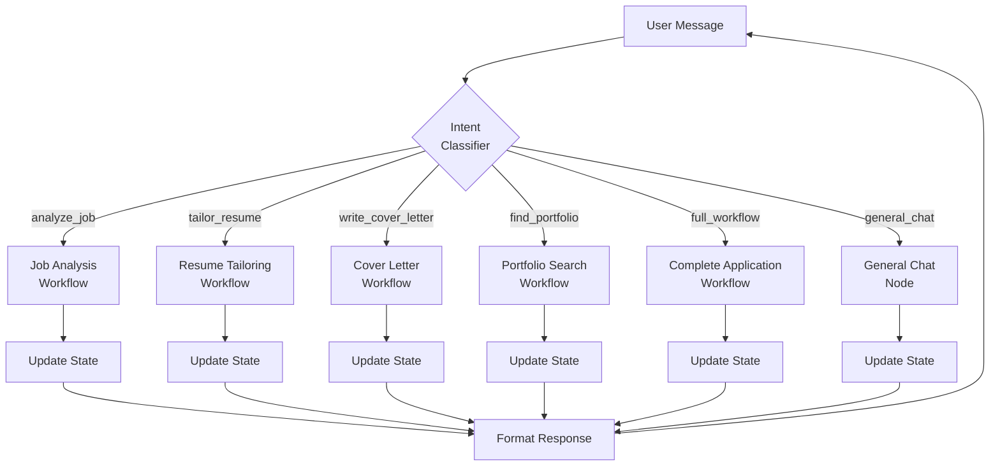

**Flow Steps**:
1. User sends message to agent
2. Intent classifier analyzes message and extracts parameters
3. Conditional router directs to appropriate workflow
4. Workflow executes (load data, process with LLM, save results)
5. State updated with results
6. Response formatted and sent to user

---

## Flow 1: User Input → Intent Classification → Routing

### Intent Classification Node

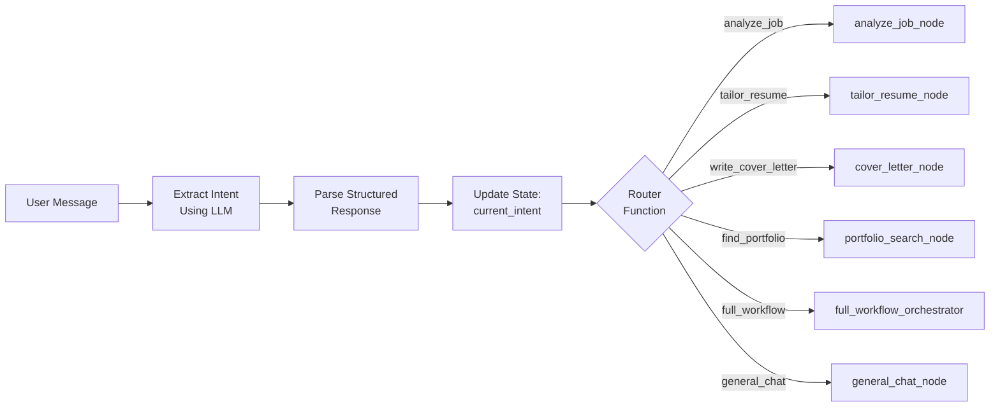

### Intent Classifier Implementation

```python
from langchain_core.messages import HumanMessage, AIMessage
from typing import Literal

def intent_classifier_node(state: ResumeAgentState) -> dict:
    """Classify user intent and extract parameters"""

    # Get latest user message
    last_message = state["messages"][-1]

    # Call LLM with structured output
    llm = get_llm()  # Claude or OpenAI
    prompt = f"""Analyze the user's message and classify their intent.

User message: {last_message.content}

Available intents:
- analyze_job: User wants to analyze a job posting (extract job_url)
- tailor_resume: User wants to tailor resume for a job (extract company, job_title)
- write_cover_letter: User wants to write a cover letter
- find_portfolio: User wants to find relevant portfolio examples
- full_workflow: User wants complete application workflow
- general_chat: User has a general question or conversation

Extract any parameters like job URLs, company names, job titles.
"""

    response = llm.invoke(prompt)

    # Parse response (using structured output or JSON)
    intent_data = parse_intent(response)

    # Update state
    return {
        "current_intent": {
            "intent_type": intent_data["intent_type"],
            "confidence": intent_data["confidence"],
            "extracted_params": intent_data.get("params", {})
        }
    }
```

### Router Function

```python
def route_by_intent(state: ResumeAgentState) -> str:
    """Route to appropriate workflow based on intent"""

    intent = state.get("current_intent")
    if not intent:
        return "general_chat_node"

    intent_type = intent["intent_type"]

    # Map intents to node names
    routing_table = {
        "analyze_job": "analyze_job_node",
        "tailor_resume": "tailor_resume_node",
        "write_cover_letter": "cover_letter_node",
        "find_portfolio": "portfolio_search_node",
        "full_workflow": "full_workflow_orchestrator",
        "general_chat": "general_chat_node"
    }

    return routing_table.get(intent_type, "general_chat_node")
```

---

## Flow 2: Data Loading (SQLite → State)

### Master Resume Loading

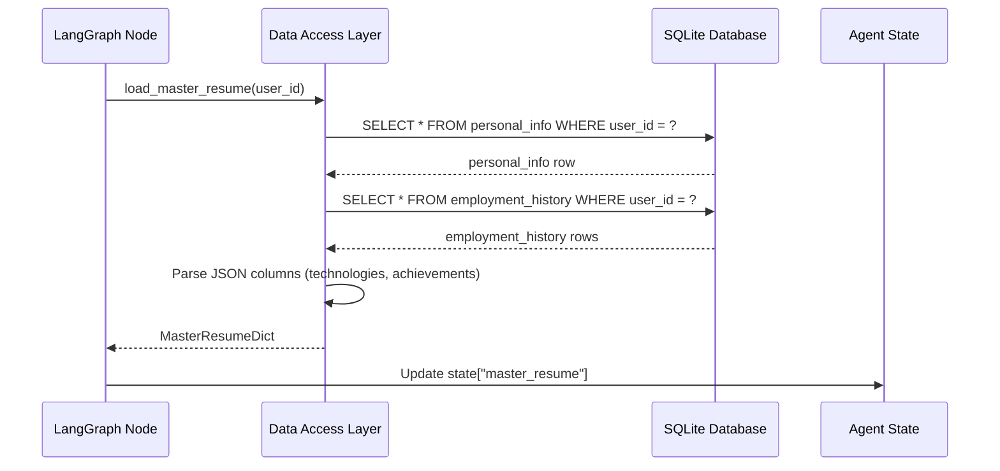

### Implementation

```python
def load_master_resume_node(state: ResumeAgentState) -> dict:
    """Load master resume from database into state"""

    user_id = state.get("user_id", "default")

    # Call existing DAL function (reused from MCP server)
    from resume_agent import data_read_master_resume

    try:
        master_resume_data = data_read_master_resume()

        # Parse response (DAL returns dict with 'data' key)
        master_resume = master_resume_data.get("data", {})

        return {
            "master_resume": master_resume,
            "messages": [AIMessage(content="Loaded your master resume")]
        }

    except Exception as e:
        return {
            "error_message": f"Failed to load master resume: {str(e)}",
            "messages": [AIMessage(content="Could not load your resume. Please check your profile.")]
        }
```

### Job Analysis Loading

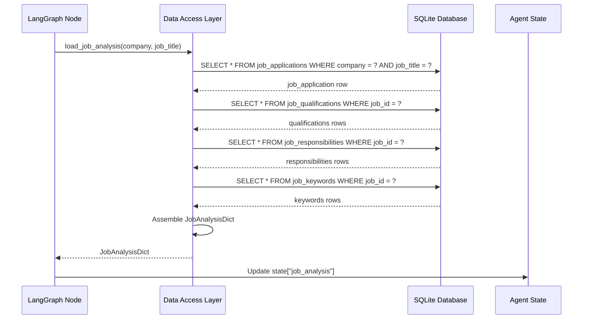

### Implementation

```python
def load_job_analysis_node(state: ResumeAgentState) -> dict:
    """Load job analysis from database into state"""

    # Extract params from intent
    intent = state.get("current_intent", {})
    company = intent.get("extracted_params", {}).get("company")
    job_title = intent.get("extracted_params", {}).get("job_title")

    if not company or not job_title:
        return {
            "requires_user_input": True,
            "messages": [AIMessage(content="Please provide the company name and job title")]
        }

    # Call existing DAL function
    from resume_agent import data_read_job_analysis

    try:
        job_analysis_data = data_read_job_analysis(
            company=company,
            job_title=job_title
        )

        job_analysis = job_analysis_data.get("data", {})

        if not job_analysis:
            return {
                "messages": [AIMessage(content=f"No job analysis found for {company} - {job_title}. Would you like me to analyze this job?")]
            }

        return {
            "job_analysis": job_analysis,
            "messages": [AIMessage(content=f"Loaded job analysis for {company} - {job_title}")]
        }

    except Exception as e:
        return {
            "error_message": f"Failed to load job analysis: {str(e)}",
            "messages": [AIMessage(content="Could not load job analysis.")]
        }
```

---

## Flow 3: LLM Processing

### Job Analysis Workflow

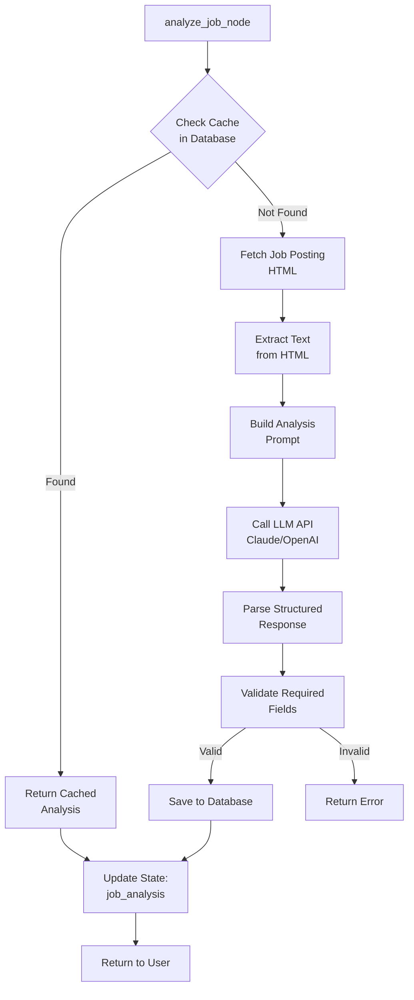

### Implementation

```python
def analyze_job_node(state: ResumeAgentState) -> dict:
    """Analyze job posting with LLM"""

    # Extract job URL from intent
    intent = state.get("current_intent", {})
    job_url = intent.get("extracted_params", {}).get("job_url")

    if not job_url:
        return {
            "requires_user_input": True,
            "messages": [AIMessage(content="Please provide a job posting URL")]
        }

    # Check cache first
    from resume_agent import data_read_job_analysis
    cached = check_job_analysis_cache(job_url)
    if cached:
        return {
            "job_analysis": cached,
            "messages": [AIMessage(content=f"Found cached analysis for this job.")]
        }

    # Fetch job posting
    try:
        html_content = fetch_url(job_url)
        text_content = extract_text_from_html(html_content)
    except Exception as e:
        return {
            "error_message": f"Failed to fetch job posting: {str(e)}",
            "messages": [AIMessage(content="Could not fetch the job posting. Please check the URL.")]
        }

    # Build prompt
    prompt = f"""Analyze this job posting and extract structured information.

Job URL: {job_url}

Job Posting:
{text_content}

Extract:
- Company name
- Job title
- Location
- Salary range (if mentioned)
- Required qualifications
- Preferred qualifications
- Key responsibilities
- ATS keywords (technologies, skills, buzzwords)
- Ideal candidate profile summary

Return as JSON with these fields.
"""

    # Call LLM
    llm = get_llm()
    response = llm.invoke(prompt)

    # Parse structured response
    try:
        analysis_data = parse_json_response(response)
        analysis_data["url"] = job_url
        analysis_data["raw_description"] = html_content
        analysis_data["fetched_at"] = datetime.utcnow().isoformat()

        # Save to database
        from resume_agent import data_write_job_analysis
        data_write_job_analysis(
            company=analysis_data["company"],
            job_title=analysis_data["job_title"],
            job_data=analysis_data
        )

        return {
            "job_analysis": analysis_data,
            "messages": [AIMessage(content=f"Analyzed job posting for {analysis_data['company']} - {analysis_data['job_title']}")]
        }

    except Exception as e:
        return {
            "error_message": f"Failed to parse LLM response: {str(e)}",
            "messages": [AIMessage(content="Analysis failed. Please try again.")]
        }
```

### Resume Tailoring Workflow

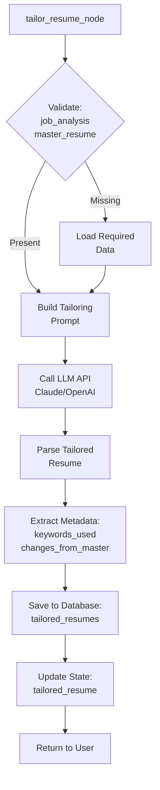

### Implementation

```python
def tailor_resume_node(state: ResumeAgentState) -> dict:
    """Tailor master resume for specific job"""

    # Validate prerequisites
    if not validate_can_tailor_resume(state):
        return {
            "requires_user_input": True,
            "messages": [AIMessage(content="I need the job analysis and your master resume first.")]
        }

    job_analysis = state["job_analysis"]
    master_resume = state["master_resume"]

    # Build prompt
    prompt = f"""Tailor this master resume for the specific job posting.

Job Analysis:
- Company: {job_analysis["company"]}
- Job Title: {job_analysis["job_title"]}
- Required Qualifications: {job_analysis["required_qualifications"]}
- Preferred Qualifications: {job_analysis.get("preferred_qualifications", [])}
- Key Responsibilities: {job_analysis["responsibilities"]}
- ATS Keywords: {job_analysis["keywords"]}

Master Resume:
{format_master_resume(master_resume)}

Instructions:
1. Highlight experiences that match required qualifications
2. Incorporate ATS keywords naturally
3. Reorder skills/experiences to prioritize relevance
4. Quantify achievements where possible
5. Keep same format as master resume (YAML or Markdown)

Also provide:
- List of ATS keywords incorporated
- List of changes made from master resume
"""

    # Call LLM
    llm = get_llm()
    response = llm.invoke(prompt)

    # Parse response
    try:
        tailored_content = extract_resume_content(response)
        keywords_used = extract_keywords_list(response)
        changes_made = extract_changes_list(response)

        # Save to database
        from resume_agent import data_write_tailored_resume
        data_write_tailored_resume(
            company=job_analysis["company"],
            job_title=job_analysis["job_title"],
            content=tailored_content,
            metadata={
                "keywords_used": keywords_used,
                "changes_from_master": changes_made
            }
        )

        return {
            "tailored_resume": {
                "company": job_analysis["company"],
                "job_title": job_analysis["job_title"],
                "content": tailored_content,
                "keywords_used": keywords_used,
                "changes_from_master": changes_made,
                "created_at": datetime.utcnow().isoformat()
            },
            "messages": [AIMessage(content=f"Tailored your resume for {job_analysis['company']}. Incorporated {len(keywords_used)} ATS keywords.")]
        }

    except Exception as e:
        return {
            "error_message": f"Failed to tailor resume: {str(e)}",
            "messages": [AIMessage(content="Resume tailoring failed. Please try again.")]
        }
```

---

## Flow 4: Data Persistence (State → SQLite)

### Save Workflow Results

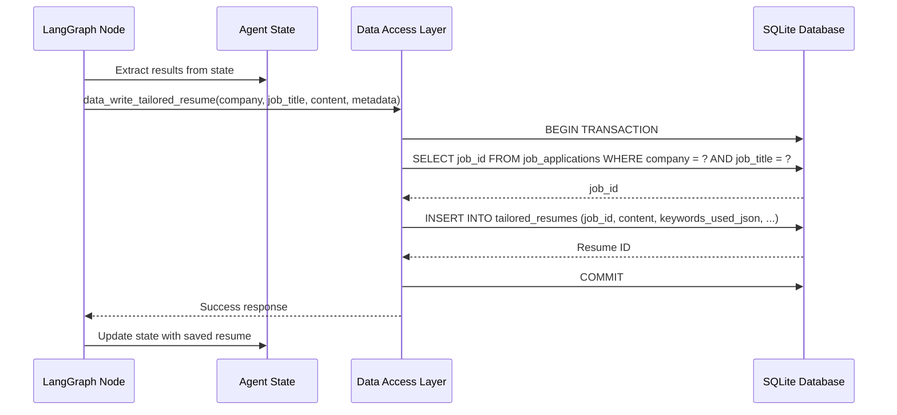

### Implementation Pattern

```python
def save_results_node(state: ResumeAgentState) -> dict:
    """Persist workflow results to database"""

    # Extract results from state
    tailored_resume = state.get("tailored_resume")
    cover_letter = state.get("cover_letter")
    portfolio_examples = state.get("portfolio_examples", [])

    errors = []

    # Save tailored resume if present
    if tailored_resume:
        try:
            from resume_agent import data_write_tailored_resume
            data_write_tailored_resume(
                company=tailored_resume["company"],
                job_title=tailored_resume["job_title"],
                content=tailored_resume["content"],
                metadata={
                    "keywords_used": tailored_resume.get("keywords_used", []),
                    "changes_from_master": tailored_resume.get("changes_from_master", [])
                }
            )
        except Exception as e:
            errors.append(f"Failed to save resume: {str(e)}")

    # Save cover letter if present
    if cover_letter:
        try:
            from resume_agent import data_write_cover_letter
            data_write_cover_letter(
                company=cover_letter["company"],
                job_title=cover_letter["job_title"],
                content=cover_letter["content"],
                metadata={
                    "talking_points": cover_letter.get("talking_points", [])
                }
            )
        except Exception as e:
            errors.append(f"Failed to save cover letter: {str(e)}")

    # Save portfolio examples if present
    if portfolio_examples:
        try:
            from resume_agent import data_write_portfolio_examples
            data_write_portfolio_examples(
                company=state["job_analysis"]["company"],
                job_title=state["job_analysis"]["job_title"],
                content=format_portfolio_examples(portfolio_examples)
            )
        except Exception as e:
            errors.append(f"Failed to save portfolio examples: {str(e)}")

    if errors:
        return {
            "error_message": "; ".join(errors),
            "messages": [AIMessage(content="Some results could not be saved.")]
        }

    return {
        "messages": [AIMessage(content="All results saved successfully!")]
    }
```

---

## Flow 5: Output Formatting (State → User)

### Response Formatting Node

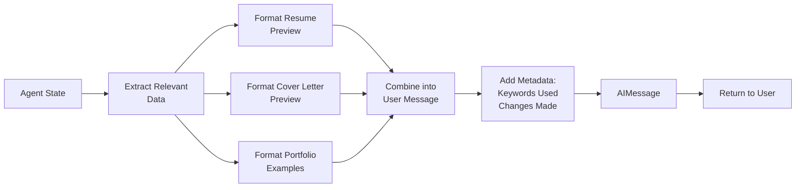

### Implementation

```python
def format_response_node(state: ResumeAgentState) -> dict:
    """Format final response for user"""

    # Build response message
    response_parts = []

    # Job analysis summary
    if state.get("job_analysis"):
        job = state["job_analysis"]
        response_parts.append(f"""
**Job Analysis: {job['company']} - {job['job_title']}**

Location: {job['location']}
{f"Salary: {job['salary_range']}" if job.get('salary_range') else ""}

Required Skills: {', '.join(job['required_qualifications'][:5])}...
""")

    # Tailored resume summary
    if state.get("tailored_resume"):
        resume = state["tailored_resume"]
        response_parts.append(f"""
**Tailored Resume**

Keywords incorporated: {len(resume.get('keywords_used', []))}
Changes from master: {len(resume.get('changes_from_master', []))}

Preview:
```
{resume['content'][:500]}...
```
""")

    # Cover letter summary
    if state.get("cover_letter"):
        cover = state["cover_letter"]
        response_parts.append(f"""
**Cover Letter**

Talking points:
{format_talking_points(cover.get('talking_points', []))}

Preview:
```
{cover['content'][:300]}...
```
""")

    # Portfolio examples summary
    if state.get("portfolio_examples"):
        examples = state["portfolio_examples"]
        response_parts.append(f"""
**Portfolio Examples** ({len(examples)} found)

{format_portfolio_summary(examples[:3])}
""")

    # Error summary
    if state.get("error_message"):
        response_parts.append(f"""
**Errors Encountered**
{state['error_message']}
""")

    # Combine all parts
    final_message = "\n\n".join(response_parts)

    return {
        "messages": [AIMessage(content=final_message)]
    }
```

---

## Complete Workflow Example: Full Application

### End-to-End Data Flow

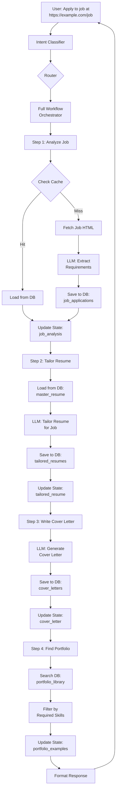

### Orchestrator Implementation

```python
def full_workflow_orchestrator(state: ResumeAgentState) -> dict:
    """Orchestrate complete job application workflow"""

    # Initialize workflow progress
    workflow_progress = {
        "workflow_type": "full_application",
        "steps_completed": [],
        "steps_remaining": ["analyze_job", "tailor_resume", "cover_letter", "portfolio_search"],
        "current_step": "analyze_job",
        "errors": []
    }

    # This orchestrator delegates to a graph with sequential steps
    # Each step is a separate node in the workflow graph

    return {
        "workflow_progress": workflow_progress,
        "messages": [AIMessage(content="Starting complete job application workflow...")]
    }

# Workflow graph would have these nodes:
# analyze_job_node -> tailor_resume_node -> cover_letter_node -> portfolio_search_node -> format_response_node
```

---

## State Transition Diagram

### State Evolution Through Workflow

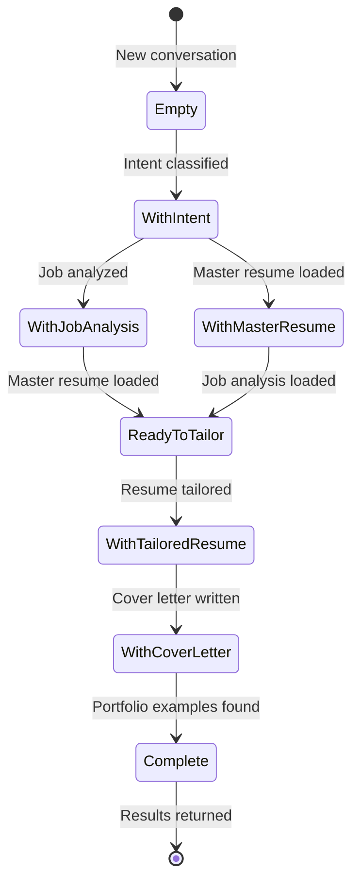

**State Properties by Stage**:

| Stage | State Properties |
|-------|------------------|
| Empty | messages: [] |
| WithIntent | messages, current_intent |
| WithJobAnalysis | messages, current_intent, job_analysis |
| WithMasterResume | messages, current_intent, master_resume |
| ReadyToTailor | messages, current_intent, job_analysis, master_resume |
| WithTailoredResume | messages, ..., tailored_resume |
| WithCoverLetter | messages, ..., cover_letter |
| Complete | messages, ..., portfolio_examples |

---

## Error Handling Flow

### Error Accumulation Pattern

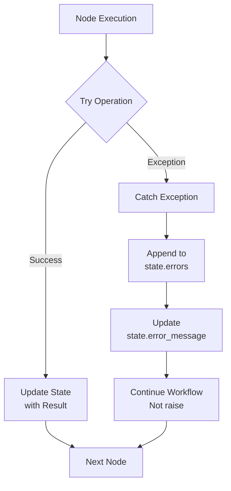

### Implementation

```python
def resilient_node(state: ResumeAgentState) -> dict:
    """Node with error accumulation (never raises)"""

    try:
        # Attempt risky operation
        result = perform_operation(state)

        return {
            "output_field": result,
            "messages": [AIMessage(content="Operation successful")]
        }

    except Exception as e:
        # Accumulate error but don't raise
        workflow_progress = state.get("workflow_progress", {})
        errors = workflow_progress.get("errors", [])
        errors.append(f"Node failed: {str(e)}")

        return {
            "error_message": str(e),
            "workflow_progress": {
                **workflow_progress,
                "errors": errors
            },
            "messages": [AIMessage(content=f"Operation failed: {str(e)}. Continuing workflow...")]
        }
```

---

## Caching Strategy

### Cache-Check Pattern

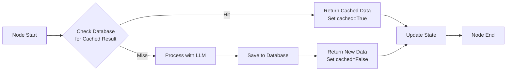

### Implementation

```python
def cached_job_analysis_node(state: ResumeAgentState) -> dict:
    """Job analysis with database caching"""

    job_url = state["current_intent"]["extracted_params"]["job_url"]

    # Try to load from database
    from resume_agent import data_read_job_analysis
    try:
        # Extract company/title from URL or state
        company = extract_company_from_url(job_url)
        title = extract_title_from_url(job_url)

        cached_analysis = data_read_job_analysis(company, title)

        if cached_analysis and cached_analysis.get("data"):
            return {
                "job_analysis": cached_analysis["data"],
                "cached": True,
                "messages": [AIMessage(content=f"Found cached analysis for {company} - {title}")]
            }

    except Exception:
        pass  # Cache miss, proceed to LLM processing

    # Cache miss - process with LLM
    # ... (LLM processing code from earlier) ...

    return {
        "job_analysis": new_analysis,
        "cached": False,
        "messages": [AIMessage(content="Analyzed job posting (new analysis)")]
    }
```

---

## Next Steps

- **Task 1.9**: Create architecture comparison in `architecture-comparison.md`
- **Task 1.11**: Create workflow mapping in `workflow-mapping.md`
- **Phase 3**: Implement data access layer wrapping DAL functions
- **Phase 4**: Build LangGraph nodes following these data flow patterns

---

## References

- **MCP Tools Inventory**: `docs/mcp-tools-inventory.md`
- **Database Schema**: `docs/database-schema.md`
- **State Schema**: `docs/state-schema.md`
- **Original DAL**: `apps/resume-agent/resume_agent.py`

---

**Generated**: 2025-10-26
**Phase**: 1 - Analysis & Discovery
**Status**: Complete
