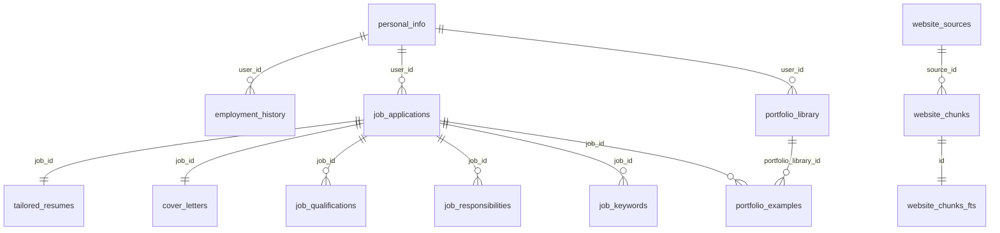

# SQLite Database Schema Documentation

**Phase 1 Deliverable**: Complete database schema documentation for LangGraph Resume Agent

**Created**: 2025-10-26
**Database Location**: `D:\source\Cernji-Agents\data\resume_agent.db`

---

## Overview

The Resume Agent uses a **SQLite database** instead of YAML files for data persistence. This provides better concurrency, transaction support, and query performance for the LangGraph implementation.

### Database Location

```
D:\source\Cernji-Agents\data\resume_agent.db
```

### Key Design Decisions

1. **SQLite over YAML**: Supports concurrent access, ACID transactions, efficient queries
2. **JSON Columns**: Complex nested data stored as JSON strings (e.g., `technologies_json`, `achievements_json`)
3. **FTS Support**: Full-text search enabled via `website_chunks_fts` table
4. **Vector Search**: sqlite-vec extension for semantic search on website chunks
5. **Timestamps**: All tables include `created_at` and/or `updated_at` for audit trails

---

## Table Categories

| Category | Tables | Description |
|----------|--------|-------------|
| **User Data** | personal_info, employment_history | Master resume components |
| **Job Applications** | job_applications, job_qualifications, job_responsibilities, job_keywords | Analyzed job postings |
| **Outputs** | tailored_resumes, cover_letters | Generated application materials |
| **Portfolio** | portfolio_library, portfolio_examples | Code examples and projects |
| **RAG Pipeline** | website_sources, website_chunks, website_chunks_fts | Processed websites with embeddings |

---

## User Data Tables

### personal_info

**Purpose**: User's contact information and professional summary

**Schema**:

| Column | Type | Nullable | Default | Description |
|--------|------|----------|---------|-------------|
| id | INTEGER | No | - | Primary key |
| user_id | VARCHAR | No | - | User identifier (multi-user support) |
| name | VARCHAR | No | - | Full name |
| phone | VARCHAR | Yes | NULL | Phone number |
| email | VARCHAR | Yes | NULL | Email address |
| linkedin | VARCHAR | Yes | NULL | LinkedIn profile URL |
| title | VARCHAR | Yes | NULL | Professional title |
| about_me | VARCHAR | Yes | NULL | Short bio |
| professional_summary | VARCHAR | Yes | NULL | Detailed professional summary |
| created_at | DATETIME | No | - | Record creation timestamp |
| updated_at | DATETIME | No | - | Last update timestamp |

**Indexes**:
- Primary key on `id`
- Should index `user_id` for multi-user lookups

**Notes**:
- One record per user (enforced by application logic, not DB constraint)
- Maps to `personal_info` section of master resume YAML

**Example Data**:
```sql
SELECT * FROM personal_info WHERE user_id = 'default';
```

```
id: 1
user_id: default
name: John Doe
phone: +81-90-1234-5678
email: john@example.com
linkedin: linkedin.com/in/johndoe
title: Senior Software Engineer
about_me: Passionate developer with 10+ years experience...
professional_summary: Experienced engineer specializing in...
created_at: 2025-01-15 10:00:00
updated_at: 2025-10-26 09:30:00
```

---

### employment_history

**Purpose**: User's work experience with achievements and technologies

**Schema**:

| Column | Type | Nullable | Default | Description |
|--------|------|----------|---------|-------------|
| id | INTEGER | No | - | Primary key |
| user_id | VARCHAR | No | - | User identifier |
| company | VARCHAR | No | - | Company name |
| position | VARCHAR | Yes | NULL | Job position/role |
| title | VARCHAR | Yes | NULL | Job title (alternative to position) |
| employment_type | VARCHAR | Yes | NULL | Full-time, Contract, etc. |
| start_date | VARCHAR | No | - | Start date (YYYY-MM format) |
| end_date | VARCHAR | Yes | NULL | End date (NULL = current position) |
| description | VARCHAR | No | - | Role description |
| technologies_json | VARCHAR | Yes | NULL | JSON array of technologies used |
| achievements_json | VARCHAR | Yes | NULL | JSON array of achievement objects |
| created_at | DATETIME | No | - | Record creation timestamp |
| updated_at | DATETIME | No | - | Last update timestamp |

**Indexes**:
- Primary key on `id`
- Should index `user_id` and `company` for lookups

**JSON Structures**:

**technologies_json**:
```json
["Python", "FastAPI", "PostgreSQL", "Docker", "AWS"]
```

**achievements_json**:
```json
[
  {
    "description": "Reduced API latency by 50% through caching optimization",
    "metric": "50% latency reduction"
  },
  {
    "description": "Led team of 5 engineers to deliver microservices architecture",
    "metric": "5 engineers, 3 months"
  }
]
```

**Notes**:
- Multiple records per user (one per job)
- Maps to `employment_history` array in master resume YAML
- Date format is flexible string to support various formats (YYYY-MM, YYYY, etc.)

**LangGraph Integration**:
```python
# Load employment history into state
def load_employment_history(user_id: str) -> List[Dict]:
    rows = db.execute(
        "SELECT * FROM employment_history WHERE user_id = ? ORDER BY start_date DESC",
        (user_id,)
    ).fetchall()

    # Parse JSON columns
    for row in rows:
        row["technologies"] = json.loads(row["technologies_json"]) if row["technologies_json"] else []
        row["achievements"] = json.loads(row["achievements_json"]) if row["achievements_json"] else []

    return rows
```

---

## Job Application Tables

### job_applications

**Purpose**: Analyzed job postings with extracted requirements

**Schema**:

| Column | Type | Nullable | Default | Description |
|--------|------|----------|---------|-------------|
| id | INTEGER | No | - | Primary key |
| user_id | VARCHAR | No | - | User identifier |
| url | VARCHAR | No | - | Job posting URL |
| company | VARCHAR | No | - | Company name |
| job_title | VARCHAR | No | - | Job title |
| location | VARCHAR | No | - | Job location |
| salary_range | VARCHAR | Yes | NULL | Salary range (if available) |
| candidate_profile | VARCHAR | No | - | Ideal candidate description |
| raw_description | VARCHAR | No | - | Full HTML/text of job posting |
| fetched_at | VARCHAR | No | - | ISO timestamp when job was fetched |
| created_at | DATETIME | No | - | Record creation timestamp |
| updated_at | DATETIME | No | - | Last update timestamp |

**Indexes**:
- Primary key on `id`
- Unique index on `(user_id, company, job_title)` for deduplication
- Index on `url` for lookups

**Related Tables**:
- `job_qualifications` - Required/preferred qualifications (one-to-many)
- `job_responsibilities` - Key responsibilities (one-to-many)
- `job_keywords` - ATS keywords (one-to-many)

**Notes**:
- Central table for job analysis workflow
- `raw_description` stores original HTML for re-analysis if needed
- Related data split into normalized tables for efficient queries

---

### job_qualifications

**Purpose**: Required and preferred qualifications for job

**Schema** (inferred from relational structure):
```sql
CREATE TABLE job_qualifications (
    id INTEGER PRIMARY KEY,
    job_id INTEGER NOT NULL,
    qualification_type VARCHAR NOT NULL,  -- 'required' or 'preferred'
    qualification VARCHAR NOT NULL,
    created_at DATETIME NOT NULL,
    FOREIGN KEY (job_id) REFERENCES job_applications(id) ON DELETE CASCADE
);
```

**Example Data**:
```
job_id: 1, type: required, qualification: "5+ years Python experience"
job_id: 1, type: required, qualification: "Experience with FastAPI or Flask"
job_id: 1, type: preferred, qualification: "LangChain knowledge"
```

---

### job_responsibilities

**Purpose**: Key responsibilities for the role

**Schema** (inferred):
```sql
CREATE TABLE job_responsibilities (
    id INTEGER PRIMARY KEY,
    job_id INTEGER NOT NULL,
    responsibility VARCHAR NOT NULL,
    created_at DATETIME NOT NULL,
    FOREIGN KEY (job_id) REFERENCES job_applications(id) ON DELETE CASCADE
);
```

---

### job_keywords

**Purpose**: ATS keywords extracted from job posting

**Schema** (inferred):
```sql
CREATE TABLE job_keywords (
    id INTEGER PRIMARY KEY,
    job_id INTEGER NOT NULL,
    keyword VARCHAR NOT NULL,
    frequency INTEGER DEFAULT 1,  -- How many times keyword appears
    created_at DATETIME NOT NULL,
    FOREIGN KEY (job_id) REFERENCES job_applications(id) ON DELETE CASCADE
);
```

**Notes**:
- Used for ATS optimization in tailored resumes
- Frequency helps prioritize important keywords

---

## Output Tables

### tailored_resumes

**Purpose**: Job-specific optimized resumes

**Schema**:

| Column | Type | Nullable | Default | Description |
|--------|------|----------|---------|-------------|
| id | INTEGER | No | - | Primary key |
| job_id | INTEGER | No | - | Foreign key to job_applications |
| content | VARCHAR | No | - | Full resume content (Markdown/YAML) |
| keywords_used_json | VARCHAR | Yes | NULL | JSON array of keywords incorporated |
| changes_from_master_json | VARCHAR | Yes | NULL | JSON array of changes made |
| created_at | DATETIME | No | - | Record creation timestamp |
| updated_at | DATETIME | No | - | Last update timestamp |

**JSON Structures**:

**keywords_used_json**:
```json
["Python", "FastAPI", "PostgreSQL", "Microservices", "Docker"]
```

**changes_from_master_json**:
```json
[
  "Highlighted FastAPI experience in TechCorp role",
  "Added PostgreSQL project details from Startup Inc",
  "Reordered skills to prioritize backend technologies"
]
```

**Foreign Keys**:
- `job_id` references `job_applications(id)` ON DELETE CASCADE

**Notes**:
- One resume per job application
- Content is full resume text (can be YAML or Markdown depending on output format)
- Changes log helps user understand what was tailored

---

### cover_letters

**Purpose**: Job-specific cover letters

**Schema**:

| Column | Type | Nullable | Default | Description |
|--------|------|----------|---------|-------------|
| id | INTEGER | No | - | Primary key |
| job_id | INTEGER | No | - | Foreign key to job_applications |
| content | VARCHAR | No | - | Full cover letter text |
| talking_points_json | VARCHAR | Yes | NULL | JSON array of key talking points |
| created_at | DATETIME | No | - | Record creation timestamp |
| updated_at | DATETIME | No | - | Last update timestamp |

**JSON Structure**:

**talking_points_json**:
```json
[
  "10+ years Python experience aligns with senior role requirements",
  "Previous FastAPI microservices project at TechCorp demonstrates relevant skills",
  "Team leadership experience matches mentorship responsibility",
  "Passion for clean code and testing aligns with company culture"
]
```

**Foreign Keys**:
- `job_id` references `job_applications(id)` ON DELETE CASCADE

---

## Portfolio Tables

### portfolio_library

**Purpose**: Job-agnostic code examples and projects

**Schema**:

| Column | Type | Nullable | Default | Description |
|--------|------|----------|---------|-------------|
| id | INTEGER | No | - | Primary key |
| user_id | VARCHAR | No | - | User identifier |
| title | VARCHAR | No | - | Example title |
| company | VARCHAR | Yes | NULL | Associated company (if from job) |
| project | VARCHAR | Yes | NULL | Project name |
| description | VARCHAR | Yes | NULL | Short description |
| content | VARCHAR | No | - | Full code example or explanation |
| technologies_json | VARCHAR | Yes | NULL | JSON array of technologies |
| file_paths_json | VARCHAR | Yes | NULL | JSON array of file paths |
| source_repo | VARCHAR | Yes | NULL | GitHub repo URL |
| created_at | DATETIME | No | - | Record creation timestamp |
| updated_at | DATETIME | No | - | Last update timestamp |

**JSON Structures**:

**technologies_json**:
```json
["Python", "LangChain", "Qdrant", "FastAPI"]
```

**file_paths_json**:
```json
["src/rag/pipeline.py", "src/rag/embeddings.py", "tests/test_rag.py"]
```

**Example Record**:
```
id: 1
title: RAG Pipeline with Semantic Search
company: NULL
project: Personal Project
description: Vector search implementation using sentence-transformers
content: <full code or markdown explanation>
technologies: ["Python", "Qdrant", "sentence-transformers"]
file_paths: ["src/rag/pipeline.py"]
source_repo: github.com/user/rag-examples
```

**Notes**:
- Generic portfolio library (not tied to specific job applications)
- Can be searched by technology, project, or keywords
- Used by portfolio search workflow to find relevant examples

---

### portfolio_examples

**Purpose**: Job-specific portfolio examples linked to applications

**Schema** (inferred from relationship with job_applications):
```sql
CREATE TABLE portfolio_examples (
    id INTEGER PRIMARY KEY,
    job_id INTEGER NOT NULL,
    portfolio_library_id INTEGER,  -- Optional link to library
    title VARCHAR NOT NULL,
    content VARCHAR NOT NULL,
    created_at DATETIME NOT NULL,
    FOREIGN KEY (job_id) REFERENCES job_applications(id) ON DELETE CASCADE,
    FOREIGN KEY (portfolio_library_id) REFERENCES portfolio_library(id) ON DELETE SET NULL
);
```

**Notes**:
- Links portfolio library examples to specific job applications
- Allows job-specific customization of portfolio presentation

---

## RAG Pipeline Tables

### website_sources

**Purpose**: Metadata about processed websites

**Schema**:

| Column | Type | Nullable | Default | Description |
|--------|------|----------|---------|-------------|
| id | INTEGER | No | - | Primary key (source_id) |
| url | TEXT | No | - | Website URL (unique) |
| title | TEXT | Yes | NULL | Page title |
| content_type | TEXT | No | - | 'job_posting', 'blog_article', 'company_page' |
| language | TEXT | No | - | Language code (e.g., 'en', 'ja') |
| raw_html | TEXT | No | - | Full HTML source |
| metadata_json | TEXT | Yes | NULL | Additional metadata as JSON |
| fetch_timestamp | DATETIME | Yes | CURRENT_TIMESTAMP | When page was fetched |
| processing_status | TEXT | Yes | 'pending' | 'pending', 'processing', 'completed', 'failed' |
| error_message | TEXT | Yes | NULL | Error details if processing failed |

**Indexes**:
- Primary key on `id`
- Unique index on `url`
- Index on `content_type` for filtering
- Index on `processing_status` for queue management

**Content Types**:
- `job_posting` - Job listings
- `blog_article` - Technical blog posts
- `company_page` - Company info, culture pages

**Processing Statuses**:
- `pending` - Not yet processed
- `processing` - Currently being chunked/embedded
- `completed` - Successfully processed
- `failed` - Processing failed (see error_message)

**metadata_json Example**:
```json
{
  "fetch_method": "playwright",
  "word_count": 1523,
  "image_count": 3,
  "link_count": 25,
  "company": "Acme Corp",
  "job_title": "Senior Developer"
}
```

---

### website_chunks

**Purpose**: Text chunks from websites with embeddings for semantic search

**Schema**:

| Column | Type | Nullable | Default | Description |
|--------|------|----------|---------|-------------|
| id | INTEGER | No | - | Primary key (chunk_id) |
| source_id | INTEGER | No | - | Foreign key to website_sources |
| chunk_index | INTEGER | No | - | Chunk sequence number (0-indexed) |
| content | TEXT | No | - | Chunk text content |
| char_count | INTEGER | No | - | Character count for chunk |
| metadata_json | TEXT | Yes | NULL | Chunk-specific metadata |
| created_at | DATETIME | Yes | CURRENT_TIMESTAMP | Chunk creation timestamp |

**Indexes**:
- Primary key on `id`
- Index on `source_id` for source-based queries
- Index on `(source_id, chunk_index)` for ordered retrieval

**Foreign Keys**:
- `source_id` references `website_sources(id)` ON DELETE CASCADE

**Vector Storage**:
- Embeddings stored via sqlite-vec extension in separate vector table
- Each chunk has corresponding 384-dimensional embedding (all-MiniLM-L6-v2)

**metadata_json Example**:
```json
{
  "section": "Requirements",
  "heading": "Required Qualifications",
  "chunk_type": "paragraph"
}
```

**Chunking Strategy**:
- RecursiveCharacterTextSplitter with 500 char chunks, 50 char overlap
- Preserves semantic boundaries (paragraphs, sections)
- chunk_index maintains order for context reconstruction

---

### website_chunks_fts

**Purpose**: Full-text search index for website chunks

**Schema**:
```sql
CREATE VIRTUAL TABLE website_chunks_fts USING fts5(
    content,
    content=website_chunks,
    content_rowid=id
);
```

**Notes**:
- FTS5 virtual table for fast keyword search
- Synced with website_chunks table
- Used for hybrid search (keyword + vector)

**Usage Example**:
```sql
-- Keyword search
SELECT chunk_id, rank
FROM website_chunks_fts
WHERE website_chunks_fts MATCH 'python AND fastapi'
ORDER BY rank
LIMIT 10;
```

---

## Database Relationships

### Entity Relationship Diagram



---

## Data Access Patterns

### Pattern 1: Load Master Resume into State

```python
def load_master_resume(user_id: str) -> MasterResumeDict:
    """Load complete master resume for user"""

    # Get personal info
    personal = db.execute(
        "SELECT * FROM personal_info WHERE user_id = ?",
        (user_id,)
    ).fetchone()

    # Get employment history
    employment = db.execute(
        "SELECT * FROM employment_history WHERE user_id = ? ORDER BY start_date DESC",
        (user_id,)
    ).fetchall()

    # Parse JSON columns
    for emp in employment:
        emp["technologies"] = json.loads(emp["technologies_json"] or "[]")
        emp["achievements"] = json.loads(emp["achievements_json"] or "[]")

    return {
        "personal_info": dict(personal),
        "employment_history": [dict(e) for e in employment]
    }
```

### Pattern 2: Load Job Analysis into State

```python
def load_job_analysis(company: str, job_title: str, user_id: str) -> JobAnalysisDict:
    """Load complete job analysis"""

    # Get job application
    job = db.execute(
        "SELECT * FROM job_applications WHERE user_id = ? AND company = ? AND job_title = ?",
        (user_id, company, job_title)
    ).fetchone()

    if not job:
        return None

    # Get qualifications
    qualifications = db.execute(
        "SELECT qualification_type, qualification FROM job_qualifications WHERE job_id = ?",
        (job["id"],)
    ).fetchall()

    # Get responsibilities
    responsibilities = db.execute(
        "SELECT responsibility FROM job_responsibilities WHERE job_id = ?",
        (job["id"],)
    ).fetchall()

    # Get keywords
    keywords = db.execute(
        "SELECT keyword FROM job_keywords WHERE job_id = ? ORDER BY frequency DESC",
        (job["id"],)
    ).fetchall()

    return {
        **dict(job),
        "required_qualifications": [q["qualification"] for q in qualifications if q["qualification_type"] == "required"],
        "preferred_qualifications": [q["qualification"] for q in qualifications if q["qualification_type"] == "preferred"],
        "responsibilities": [r["responsibility"] for r in responsibilities],
        "keywords": [k["keyword"] for k in keywords]
    }
```

### Pattern 3: Save Tailored Resume

```python
def save_tailored_resume(job_id: int, content: str, metadata: dict) -> int:
    """Save tailored resume for job"""

    # Check if resume already exists
    existing = db.execute(
        "SELECT id FROM tailored_resumes WHERE job_id = ?",
        (job_id,)
    ).fetchone()

    if existing:
        # Update existing
        db.execute(
            """UPDATE tailored_resumes
               SET content = ?, keywords_used_json = ?, changes_from_master_json = ?, updated_at = CURRENT_TIMESTAMP
               WHERE id = ?""",
            (content, json.dumps(metadata.get("keywords_used", [])),
             json.dumps(metadata.get("changes_from_master", [])), existing["id"])
        )
        db.commit()
        return existing["id"]
    else:
        # Insert new
        cursor = db.execute(
            """INSERT INTO tailored_resumes (job_id, content, keywords_used_json, changes_from_master_json, created_at, updated_at)
               VALUES (?, ?, ?, ?, CURRENT_TIMESTAMP, CURRENT_TIMESTAMP)""",
            (job_id, content, json.dumps(metadata.get("keywords_used", [])),
             json.dumps(metadata.get("changes_from_master", [])))
        )
        db.commit()
        return cursor.lastrowid
```

### Pattern 4: RAG Query

```python
def rag_query(query: str, content_type: str = None, max_results: int = 10) -> List[Dict]:
    """Semantic search across website chunks"""

    # Generate query embedding
    from sentence_transformers import SentenceTransformer
    model = SentenceTransformer("all-MiniLM-L6-v2")
    query_embedding = model.encode(query)

    # Vector search (using sqlite-vec extension)
    # This is pseudocode - actual implementation depends on sqlite-vec API
    results = db.execute(
        """SELECT
            wc.id as chunk_id,
            wc.source_id,
            wc.content,
            ws.url,
            ws.title,
            ws.content_type,
            vec_distance_l2(wc.embedding, ?) as distance
           FROM website_chunks wc
           JOIN website_sources ws ON wc.source_id = ws.id
           WHERE (? IS NULL OR ws.content_type = ?)
           ORDER BY distance ASC
           LIMIT ?""",
        (query_embedding.tobytes(), content_type, content_type, max_results)
    ).fetchall()

    return [dict(r) for r in results]
```

---

## LangGraph State Mapping

### MasterResumeDict Structure

```python
from typing import TypedDict, List, Optional

class PersonalInfoDict(TypedDict, total=False):
    name: str
    email: str
    phone: str
    linkedin: str
    title: str

class EmploymentDict(TypedDict, total=False):
    company: str
    position: str
    start_date: str
    end_date: Optional[str]
    description: str
    technologies: List[str]
    achievements: List[dict]

class MasterResumeDict(TypedDict, total=False):
    personal_info: PersonalInfoDict
    employment_history: List[EmploymentDict]
```

### JobAnalysisDict Structure

```python
class JobAnalysisDict(TypedDict, total=False):
    url: str
    company: str
    job_title: str
    location: str
    salary_range: Optional[str]
    candidate_profile: str
    required_qualifications: List[str]
    preferred_qualifications: List[str]
    responsibilities: List[str]
    keywords: List[str]
    raw_description: str
    fetched_at: str
```

---

## Migration Notes

### From YAML to SQLite

The LangGraph implementation uses the **existing SQLite database** instead of YAML files. No migration needed as the original MCP server already uses this database.

**Original MCP Server**:
- Uses SQLite database at `data/resume_agent.db`
- DAL functions in `resume_agent.py` handle all database access
- YAML files mentioned in docs are legacy or exported formats

**LangGraph Implementation**:
- Reuses same database and DAL functions
- No schema changes required
- State loading functions call existing DAL

---

## Performance Considerations

### Indexes for Common Queries

```sql
-- User data lookups
CREATE INDEX idx_personal_info_user_id ON personal_info(user_id);
CREATE INDEX idx_employment_history_user_id ON employment_history(user_id);

-- Job application lookups
CREATE INDEX idx_job_applications_user_company_title ON job_applications(user_id, company, job_title);
CREATE INDEX idx_job_applications_url ON job_applications(url);

-- Portfolio searches
CREATE INDEX idx_portfolio_library_user_id ON portfolio_library(user_id);

-- RAG queries
CREATE INDEX idx_website_sources_content_type ON website_sources(content_type);
CREATE INDEX idx_website_sources_status ON website_sources(processing_status);
CREATE INDEX idx_website_chunks_source_id ON website_chunks(source_id);
```

### Query Optimization

1. **Use prepared statements** for repeated queries
2. **Load related data in single query** using JOINs when possible
3. **Cache master resume** in state to avoid repeated DB hits
4. **Use vector index** for RAG queries (sqlite-vec extension)

---

## Next Steps

- **Task 1.8**: Document data flow patterns in `data-flow.md`
- **Phase 3**: Implement data access layer wrapping existing DAL functions
- **Phase 4**: Build LangGraph nodes that load/save state using these schemas

---

## References

- **Database**: `D:\source\Cernji-Agents\data\resume_agent.db`
- **Original DAL**: `apps/resume-agent/resume_agent.py` (lines 200-600)
- **MCP Tools Inventory**: `docs/mcp-tools-inventory.md`
- **State Schema**: `docs/state-schema.md`

---

**Generated**: 2025-10-26
**Phase**: 1 - Analysis & Discovery
**Status**: Complete
