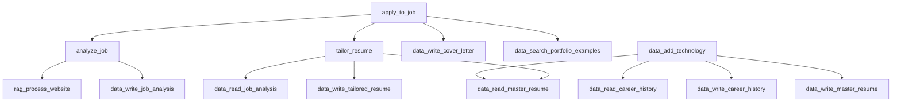

# MCP Tools Inventory

Complete inventory of all 30 MCP tools from the Resume Agent MCP server (`apps/resume-agent/resume_agent.py`).

**Purpose**: This document serves as a reference for Phase 1 of the LangGraph implementation. It catalogs all existing functionality that needs to be migrated to the LangGraph agent architecture.

**Total Tools**: 30
**Last Updated**: 2025-10-26

---

## Tool Categories Summary

| Category | Tool Count | Description |
|----------|------------|-------------|
| Data Access - Read | 6 | Read career data from database |
| Data Access - Write | 6 | Write/update career data to database |
| Data Access - Utility | 7 | Manage achievements, technologies, portfolio |
| RAG Pipeline | 6 | Process and query websites with embeddings |
| Portfolio Management | 2 | Update and delete portfolio examples |
| Job Application Workflow | 3 | High-level orchestration tools |

---

## Data Access - Read Operations

**Category**: Data Access
**Tool Count**: 6

| # | Function Name | Description | Parameters | Return Type | Reuse Strategy |
|---|--------------|-------------|------------|-------------|----------------|
| 1 | `data_read_master_resume` | Read the master resume and return validated data | None | `dict[str, Any]` | ✅ Reuse directly |
| 2 | `data_read_career_history` | Read the career history and return validated data | None | `dict[str, Any]` | ✅ Reuse directly |
| 3 | `data_read_job_analysis` | Read job analysis data for a specific application | `company: str`<br>`job_title: str` | `dict[str, Any]` | ✅ Reuse directly |
| 4 | `data_read_tailored_resume` | Read tailored resume for a specific application | `company: str`<br>`job_title: str` | `dict[str, Any]` | ✅ Reuse directly |
| 5 | `data_read_cover_letter` | Read cover letter for a specific application | `company: str`<br>`job_title: str` | `dict[str, Any]` | ✅ Reuse directly |
| 6 | `data_list_applications` | List recent job applications | `limit: int = 10` | `dict[str, Any]` | ✅ Reuse directly |

**Migration Notes**: These are pure data access functions with no business logic. Can be called directly from LangGraph nodes via MCP tool invocation or wrapped in a data access layer.

---

## Data Access - Write Operations

**Category**: Data Access
**Tool Count**: 6

| # | Function Name | Description | Parameters | Return Type | Reuse Strategy |
|---|--------------|-------------|------------|-------------|----------------|
| 7 | `data_write_job_analysis` | Save job analysis data for an application | `company: str`<br>`job_title: str`<br>`job_data: dict` | `dict[str, Any]` | ✅ Reuse directly |
| 8 | `data_write_tailored_resume` | Save tailored resume for an application | `company: str`<br>`job_title: str`<br>`content: str`<br>`metadata: dict = None` | `dict[str, Any]` | ✅ Reuse directly |
| 9 | `data_write_cover_letter` | Save cover letter for an application | `company: str`<br>`job_title: str`<br>`content: str`<br>`metadata: dict = None` | `dict[str, Any]` | ✅ Reuse directly |
| 10 | `data_write_portfolio_examples` | Save portfolio examples for an application | `company: str`<br>`job_title: str`<br>`content: str` | `dict[str, Any]` | ✅ Reuse directly |
| 11 | `data_write_master_resume` | Write the master resume with validated data | `resume_data: dict` | `dict[str, Any]` | ✅ Reuse directly |
| 12 | `data_write_career_history` | Write the career history with validated data | `history_data: dict` | `dict[str, Any]` | ✅ Reuse directly |

**Migration Notes**: These are pure data persistence functions. Can be called directly from LangGraph nodes after workflow processing.

---

## Data Access - Utility Operations

**Category**: Data Access
**Tool Count**: 7

| # | Function Name | Description | Parameters | Return Type | Reuse Strategy |
|---|--------------|-------------|------------|-------------|----------------|
| 13 | `data_add_achievement` | Add an achievement to a specific employment entry | `company: str`<br>`achievement_description: str`<br>`metric: str = None` | `dict[str, Any]` | ✅ Reuse directly |
| 14 | `data_add_technology` | Add technologies to employment entry and update resume | `company: str`<br>`technologies: List[str]` | `dict[str, Any]` | ⚠️ Review logic |
| 15 | `data_get_application_path` | Get application directory/identifier | `company: str`<br>`job_title: str`<br>`ensure_exists: bool = False` | `dict[str, Any]` | ✅ Reuse directly |
| 16 | `data_add_portfolio_example` | Add a new example to portfolio library | `title: str`<br>`content: str`<br>`company: str = None`<br>`project: str = None`<br>`description: str = None`<br>`technologies: List[str] = None`<br>`file_paths: List[str] = None`<br>`source_repo: str = None` | `dict[str, Any]` | ✅ Reuse directly |
| 17 | `data_list_portfolio_examples` | List portfolio examples with optional filters | `limit: int = None`<br>`technology_filter: str = None`<br>`company_filter: str = None` | `dict[str, Any]` | ✅ Reuse directly |
| 18 | `data_search_portfolio_examples` | Search portfolio examples by keyword/technologies | `query: str`<br>`technologies: List[str] = None` | `dict[str, Any]` | ✅ Reuse directly |
| 19 | `data_get_portfolio_example` | Get a specific portfolio example by ID | `example_id: int` | `dict[str, Any]` | ✅ Reuse directly |

**Migration Notes**: Most can be reused directly. `data_add_technology` updates both career history and master resume - may need workflow orchestration in LangGraph.

---

## Portfolio Management

**Category**: Portfolio
**Tool Count**: 2

| # | Function Name | Description | Parameters | Return Type | Reuse Strategy |
|---|--------------|-------------|------------|-------------|----------------|
| 20 | `data_update_portfolio_example` | Update an existing portfolio example | `example_id: int`<br>`title: str = None`<br>`content: str = None`<br>`company: str = None`<br>`project: str = None`<br>`description: str = None`<br>`technologies: List[str] = None`<br>`file_paths: List[str] = None`<br>`source_repo: str = None` | `dict[str, Any]` | ✅ Reuse directly |
| 21 | `data_delete_portfolio_example` | Delete a portfolio example | `example_id: int` | `dict[str, Any]` | ✅ Reuse directly |

**Migration Notes**: Simple CRUD operations. Can be called directly from LangGraph nodes.

---

## RAG Pipeline - Website Processing

**Category**: RAG
**Tool Count**: 6

| # | Function Name | Description | Parameters | Return Type | Reuse Strategy |
|---|--------------|-------------|------------|-------------|----------------|
| 22 | `rag_process_website` | Process website URL into RAG pipeline | `url: str`<br>`content_type: Literal["job_posting", "blog_article", "company_page"] = "job_posting"`<br>`force_refresh: bool = False` | `dict[str, Any]` | 🔄 Reimplement as node |
| 23 | `rag_get_website_status` | Get processing status of a website | `source_id: int` | `dict[str, Any]` | ✅ Reuse directly |
| 24 | `rag_query_websites` | Semantic search across processed websites | `query: str`<br>`max_results: int = 10`<br>`content_type_filter: Optional[Literal["job_posting", "blog_article", "company_page"]] = None`<br>`source_ids: Optional[List[int]] = None`<br>`include_synthesis: bool = False` | `dict[str, Any]` | 🔄 Reimplement as node |
| 25 | `rag_list_websites` | List all processed websites with filtering | `content_type: Optional[Literal["job_posting", "blog_article", "company_page"]] = None`<br>`status: Optional[Literal["pending", "processing", "completed", "failed"]] = None`<br>`limit: int = 20`<br>`offset: int = 0`<br>`order_by: Literal["fetch_timestamp", "title", "content_type"] = "fetch_timestamp"` | `dict[str, Any]` | ✅ Reuse directly |
| 26 | `rag_refresh_website` | Refresh a processed website | `source_id: int` | `dict[str, Any]` | 🔄 Reimplement as node |
| 27 | `rag_delete_website` | Delete website and all chunks | `source_id: int` | `dict[str, Any]` | ✅ Reuse directly |

**Migration Notes**:
- `rag_process_website` is async and complex - implement as LangGraph node with progress tracking
- `rag_query_websites` with synthesis should be a node for LLM orchestration
- Others are simple queries - can reuse directly

---

## Job Application Workflow

**Category**: Workflow Orchestration
**Tool Count**: 3

| # | Function Name | Description | Parameters | Return Type | Reuse Strategy |
|---|--------------|-------------|------------|-------------|----------------|
| 28 | `analyze_job` | Analyze job posting and extract requirements | `job_url: str` | `dict[str, Any]` | 🔄 Reimplement as node |
| 29 | `tailor_resume` | Tailor resume for specific job | `job_url: str` | `dict[str, Any]` | 🔄 Reimplement as node |
| 30 | `apply_to_job` | Complete end-to-end application workflow | `job_url: str`<br>`include_cover_letter: bool = True` | `dict[str, Any]` | 🔄 Reimplement as graph |

**Migration Notes**:
- These are high-level orchestrators that call slash commands
- Should be reimplemented as LangGraph workflows with proper state management
- `apply_to_job` maps to full multi-node graph workflow

---

## Reuse Strategy Summary

| Strategy | Count | Tools |
|----------|-------|-------|
| ✅ Reuse directly | 21 | All data access, simple CRUD, queries |
| 🔄 Reimplement as node | 6 | RAG processing, job analysis, resume tailoring |
| 🔄 Reimplement as graph | 3 | Full workflows (apply_to_job) |

**Key Insight**: 70% of tools can be reused directly via MCP tool invocation. Only 30% need reimplementation as LangGraph nodes/workflows.

---

## Tool Dependencies

### Internal Tool Dependencies



### External Dependencies

- **Database**: SQLite (`data/resume_agent.db`)
- **File System**: YAML files in `resumes/` directory
- **LLM API**: Claude/OpenAI for analysis and generation
- **Web Scraping**: BeautifulSoup, Playwright MCP (optional)
- **Vector Search**: Qdrant MCP server (optional, for RAG)
- **Embeddings**: sentence-transformers (`all-MiniLM-L6-v2`)

---

## Data Flow Patterns

### Pattern 1: Read → Process → Write
```
data_read_master_resume → [LLM Processing] → data_write_tailored_resume
```

### Pattern 2: Fetch → Process → Store → Query
```
rag_process_website → [Embedding Generation] → [Database Storage] → rag_query_websites
```

### Pattern 3: Orchestration
```
analyze_job → tailor_resume → cover_letter → portfolio_search
```

---

## Phase 1.1 Completion Summary

✅ **Task 1.1.1**: Read `resume_agent.py` in full
✅ **Task 1.1.2**: List all `@mcp.tool()` decorated functions (30 found)
✅ **Task 1.1.3**: Count total tools (30 tools, exceeding 15+ expectation)
✅ **Task 1.1.4**: Create tools inventory table with columns: Tool Name, Description, Category
✅ **Task 1.1.5**: Save inventory to `docs/mcp-tools-inventory.md`

**Next Steps**: Proceed to Phase 1.2 - Document Tool Inputs/Outputs in detail

---

**Generated**: 2025-10-26
**Source**: `apps/resume-agent/resume_agent.py`
**For**: LangGraph Resume Agent Implementation (Phase 1)
