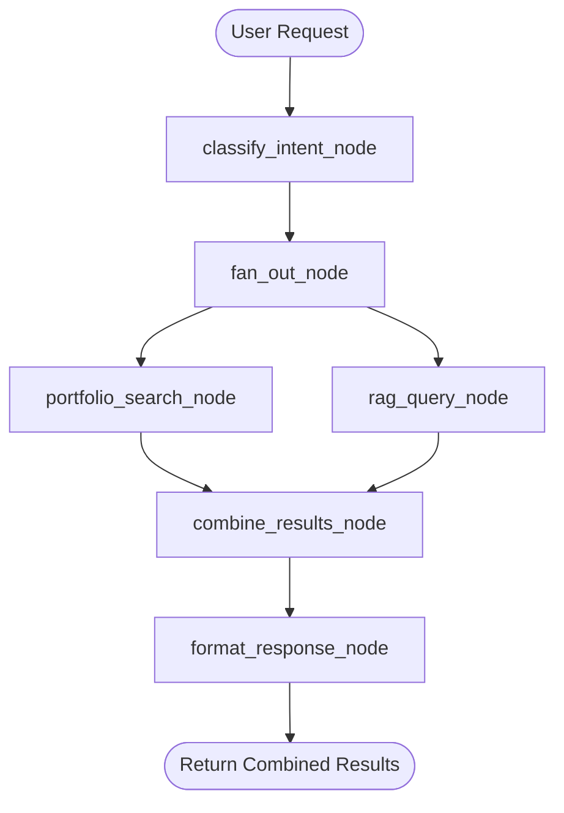
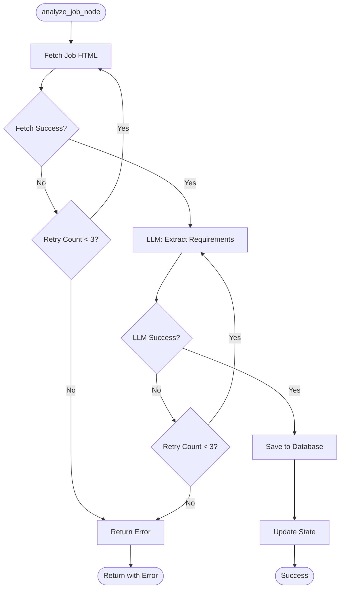
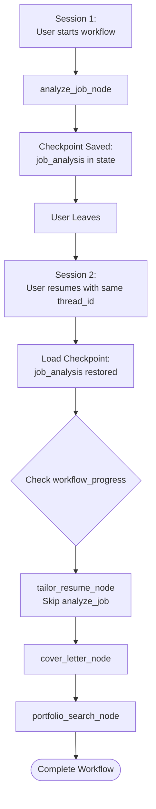

```mermaid
graph TB
    Start([User Request]) --> Intent[classify_intent_node]

    Intent --> Route{Router}

    Route -->|full_workflow| Step1[analyze_job_node]

    Step1 --> CheckCache1{Check Cache}
    CheckCache1 -->|Hit| LoadAnalysis[Load Cached Analysis]
    CheckCache1 -->|Miss| FetchJob[Fetch Job HTML]

    FetchJob --> LLM1[LLM: Extract Requirements]
    LLM1 --> SaveAnalysis[Save to DB]

    LoadAnalysis --> UpdateState1[Update State: job_analysis]
    SaveAnalysis --> UpdateState1

    UpdateState1 --> Step2[tailor_resume_node]

    Step2 --> ValidatePrereqs{Validate:<br/>job_analysis<br/>master_resume}

    ValidatePrereqs -->|Missing master| LoadMaster[Load Master Resume]
    ValidatePrereqs -->|Present| BuildPrompt[Build Tailoring Prompt]

    LoadMaster --> BuildPrompt

    BuildPrompt --> LLM2[LLM: Tailor Resume]
    LLM2 --> SaveResume[Save to DB]
    SaveResume --> UpdateState2[Update State: tailored_resume]

    UpdateState2 --> Step3[cover_letter_node]

    Step3 --> LLM3[LLM: Generate Cover Letter]
    LLM3 --> SaveCover[Save to DB]
    SaveCover --> UpdateState3[Update State: cover_letter]

    UpdateState3 --> Step4[portfolio_search_node]

    Step4 --> ExtractTech[Extract Technologies<br/>from job_analysis]
    ExtractTech --> SearchDB[Search portfolio_library]
    SearchDB --> FilterResults[Filter by Relevance]
    FilterResults --> UpdateState4[Update State: portfolio_examples]

    UpdateState4 --> FormatResponse[format_response_node]
    FormatResponse --> End([Return to User])
```

# Workflow Mapping: MCP Tool Chains → LangGraph Flows

**Phase 1 Deliverable**: Mapping of MCP tool sequences to LangGraph workflows

**Created**: 2025-10-26

---

## Overview

This document maps how **MCP tool chains** (sequences of tool calls orchestrated by Claude) translate into **LangGraph workflow graphs** (explicit node sequences with state management).

### Key Differences

| MCP Tool Chains | LangGraph Workflows |
|-----------------|---------------------|
| Claude orchestrates tool sequence | Graph defines workflow structure |
| Stateless (each tool independent) | Stateful (state flows through nodes) |
| Sequential by default | Supports parallel execution |
| No built-in error recovery | Error accumulation in state |
| No progress tracking | Explicit workflow_progress field |

---

## Workflow Catalog

### 1. Full Application Workflow

**MCP Tool Chain** (orchestrated by Claude):
```
analyze_job(job_url)
  → tailor_resume(company, job_title)
    → generate_cover_letter(company, job_title)
      → search_portfolio_examples(technologies)
```

**LangGraph Workflow**:



**Implementation**:

```python
from langgraph.graph import StateGraph, END

def build_full_application_workflow() -> StateGraph:
    """Build complete job application workflow"""

    workflow = StateGraph(ResumeAgentState)

    # Add nodes
    workflow.add_node("classify_intent", classify_intent_node)
    workflow.add_node("analyze_job", analyze_job_node)
    workflow.add_node("tailor_resume", tailor_resume_node)
    workflow.add_node("cover_letter", cover_letter_node)
    workflow.add_node("portfolio_search", portfolio_search_node)
    workflow.add_node("format_response", format_response_node)

    # Entry point
    workflow.set_entry_point("classify_intent")

    # Routing from intent classification
    def route_by_intent(state: ResumeAgentState) -> str:
        intent_type = state["current_intent"]["intent_type"]
        if intent_type == "full_workflow":
            return "analyze_job"
        # ... other routes
        return END

    workflow.add_conditional_edges("classify_intent", route_by_intent)

    # Sequential workflow
    workflow.add_edge("analyze_job", "tailor_resume")
    workflow.add_edge("tailor_resume", "cover_letter")
    workflow.add_edge("cover_letter", "portfolio_search")
    workflow.add_edge("portfolio_search", "format_response")
    workflow.add_edge("format_response", END)

    return workflow
```

**State Evolution**:

| After Node | State Fields Updated |
|------------|---------------------|
| classify_intent | current_intent, workflow_progress |
| analyze_job | job_analysis |
| tailor_resume | master_resume (if loaded), tailored_resume |
| cover_letter | cover_letter |
| portfolio_search | portfolio_examples |
| format_response | messages (final response) |

---

### 2. Resume-Only Workflow

**MCP Tool Chain**:
```
analyze_job(job_url)
  → tailor_resume(company, job_title)
```

**LangGraph Workflow**:

```mermaid
graph TB
    Start([User: "Tailor my resume for this job"]) --> Intent[classify_intent_node]

    Intent --> CheckAnalysis{Job Analysis<br/>in State?}

    CheckAnalysis -->|No| AnalyzeJob[analyze_job_node]
    CheckAnalysis -->|Yes| TailorResume[tailor_resume_node]

    AnalyzeJob --> TailorResume

    TailorResume --> CheckMaster{Master Resume<br/>in State?}

    CheckMaster -->|No| LoadMaster[Load Master Resume<br/>from Database]
    CheckMaster -->|Yes| BuildPrompt[Build Tailoring Prompt]

    LoadMaster --> BuildPrompt

    BuildPrompt --> LLM[LLM: Tailor Resume]
    LLM --> SaveDB[Save to Database]
    SaveDB --> UpdateState[Update State: tailored_resume]

    UpdateState --> FormatResponse[format_response_node]
    FormatResponse --> End([Return Resume to User])
```

**Implementation**:

```python
def build_resume_only_workflow() -> StateGraph:
    """Build resume tailoring workflow"""

    workflow = StateGraph(ResumeAgentState)

    # Add nodes
    workflow.add_node("classify_intent", classify_intent_node)
    workflow.add_node("analyze_job", analyze_job_node)
    workflow.add_node("load_master", load_master_resume_node)
    workflow.add_node("tailor_resume", tailor_resume_node)
    workflow.add_node("format_response", format_response_node)

    # Entry point
    workflow.set_entry_point("classify_intent")

    # Conditional: Check if job analysis exists
    def needs_job_analysis(state: ResumeAgentState) -> str:
        if state.get("job_analysis"):
            return "load_master"
        return "analyze_job"

    workflow.add_conditional_edges("classify_intent", needs_job_analysis)

    # After analysis, load master resume
    workflow.add_edge("analyze_job", "load_master")

    # After loading master, tailor resume
    workflow.add_edge("load_master", "tailor_resume")

    # Format and return
    workflow.add_edge("tailor_resume", "format_response")
    workflow.add_edge("format_response", END)

    return workflow
```

**Optimization**: Skip analyze_job if job_analysis already in state (from previous conversation turn).

---

### 3. Cover Letter-Only Workflow

**MCP Tool Chain**:
```
data_read_job_analysis(company, job_title)
  → data_read_master_resume()
    → generate_cover_letter(company, job_title)
```

**LangGraph Workflow**:

```mermaid
graph TB
    Start([User: "Write a cover letter"]) --> Intent[classify_intent_node]

    Intent --> CheckPrereqs{Prerequisites<br/>in State?}

    CheckPrereqs -->|job_analysis missing| LoadJobAnalysis[Load Job Analysis<br/>from Database]
    CheckPrereqs -->|master_resume missing| LoadMaster[Load Master Resume<br/>from Database]
    CheckPrereqs -->|Both present| GenerateLetter[cover_letter_node]

    LoadJobAnalysis --> CheckMaster{Master Resume<br/>in State?}
    CheckMaster -->|No| LoadMaster
    CheckMaster -->|Yes| GenerateLetter

    LoadMaster --> GenerateLetter

    GenerateLetter --> BuildPrompt[Build Cover Letter Prompt]
    BuildPrompt --> LLM[LLM: Generate Cover Letter]
    LLM --> SaveDB[Save to Database]
    SaveDB --> UpdateState[Update State: cover_letter]

    UpdateState --> FormatResponse[format_response_node]
    FormatResponse --> End([Return Cover Letter])
```

**Implementation**:

```python
def cover_letter_node(state: ResumeAgentState) -> dict:
    """Generate cover letter with prerequisites check"""

    # Check prerequisites
    missing = []
    if not state.get("job_analysis"):
        missing.append("job_analysis")
    if not state.get("master_resume"):
        missing.append("master_resume")

    if missing:
        # Load missing data from database
        if "job_analysis" in missing:
            # Extract from intent or previous state
            company = state["current_intent"]["extracted_params"].get("company")
            job_title = state["current_intent"]["extracted_params"].get("job_title")
            job_analysis = data_read_job_analysis(company, job_title)
            if job_analysis:
                state["job_analysis"] = job_analysis["data"]

        if "master_resume" in missing:
            master_resume = data_read_master_resume()
            if master_resume:
                state["master_resume"] = master_resume["data"]

    # Validate again
    if not state.get("job_analysis") or not state.get("master_resume"):
        return {
            "requires_user_input": True,
            "messages": [AIMessage(content="I need the job details and your resume to write a cover letter.")]
        }

    # Generate cover letter
    job_analysis = state["job_analysis"]
    master_resume = state["master_resume"]

    prompt = build_cover_letter_prompt(job_analysis, master_resume)
    cover_letter_text = llm.invoke(prompt)

    # Extract talking points
    talking_points = extract_talking_points(cover_letter_text)

    # Save to database
    data_write_cover_letter(
        company=job_analysis["company"],
        job_title=job_analysis["job_title"],
        content=cover_letter_text,
        metadata={"talking_points": talking_points}
    )

    return {
        "cover_letter": {
            "company": job_analysis["company"],
            "job_title": job_analysis["job_title"],
            "content": cover_letter_text,
            "talking_points": talking_points,
            "created_at": datetime.utcnow().isoformat()
        },
        "messages": [AIMessage(content=f"Generated cover letter for {job_analysis['company']}")]
    }
```

---

### 4. Portfolio Search Workflow

**MCP Tool Chain**:
```
data_read_job_analysis(company, job_title)
  → data_search_portfolio_examples(technologies=job_analysis.keywords)
```

**LangGraph Workflow**:

```mermaid
graph TB
    Start([User: "Find relevant portfolio examples"]) --> Intent[classify_intent_node]

    Intent --> CheckJobAnalysis{Job Analysis<br/>in State?}

    CheckJobAnalysis -->|No| PromptUser[Ask User for Job Details]
    CheckJobAnalysis -->|Yes| ExtractTech[Extract Technologies<br/>from job_analysis]

    PromptUser --> End1([Wait for User Input])

    ExtractTech --> SearchDB[Search portfolio_library<br/>Database]
    SearchDB --> FilterResults[Filter by Technology Match<br/>and Relevance]
    FilterResults --> RankResults[Rank by Relevance Score]
    RankResults --> UpdateState[Update State: portfolio_examples]

    UpdateState --> FormatResponse[format_response_node]
    FormatResponse --> End2([Return Examples to User])
```

**Implementation**:

```python
def portfolio_search_node(state: ResumeAgentState) -> dict:
    """Search portfolio for relevant examples"""

    # Check if job analysis exists
    if not state.get("job_analysis"):
        return {
            "requires_user_input": True,
            "messages": [AIMessage(content="Please provide job details or analyze a job first.")]
        }

    job_analysis = state["job_analysis"]

    # Extract technologies from job analysis
    required_qualifications = job_analysis.get("required_qualifications", [])
    keywords = job_analysis.get("keywords", [])

    # Combine into search query
    search_technologies = extract_technologies(required_qualifications + keywords)

    # Search portfolio library
    from resume_agent import data_search_portfolio_examples
    search_results = data_search_portfolio_examples(
        query=" ".join(search_technologies[:10]),  # Top 10 technologies
        technologies=search_technologies
    )

    portfolio_examples = search_results.get("data", {}).get("examples", [])

    if not portfolio_examples:
        return {
            "portfolio_examples": [],
            "messages": [AIMessage(content="No relevant portfolio examples found for this job.")]
        }

    # Rank by relevance (simplified)
    ranked_examples = rank_by_technology_match(portfolio_examples, search_technologies)

    return {
        "portfolio_examples": ranked_examples,
        "messages": [AIMessage(content=f"Found {len(ranked_examples)} relevant portfolio examples")]
    }
```

---

### 5. RAG Query Workflow

**MCP Tool Chain**:
```
rag_query_websites(query="Python FastAPI best practices", content_type="blog_article")
  → [Optional] Generate synthesis with LLM
```

**LangGraph Workflow**:

```mermaid
graph TB
    Start([User: "Search websites for Python best practices"]) --> Intent[classify_intent_node]

    Intent --> ExtractQuery[Extract Search Query<br/>from User Message]

    ExtractQuery --> VectorSearch[Vector Search:<br/>website_chunks]

    VectorSearch --> KeywordSearch[Keyword Search:<br/>website_chunks_fts]

    KeywordSearch --> HybridMerge[Merge Results:<br/>Hybrid Scoring]

    HybridMerge --> CheckSynthesize{User Wants<br/>Synthesis?}

    CheckSynthesize -->|No| UpdateState1[Update State: rag_query_results]
    CheckSynthesize -->|Yes| LLMSynthesize[LLM: Synthesize Findings]

    UpdateState1 --> FormatResponse[format_response_node]

    LLMSynthesize --> UpdateState2[Update State: rag_query_results<br/>+ synthesized_answer]

    UpdateState2 --> FormatResponse

    FormatResponse --> End([Return Results to User])
```

**Implementation**:

```python
def rag_query_node(state: ResumeAgentState) -> dict:
    """Semantic search across processed websites"""

    # Extract query from intent
    intent = state.get("current_intent", {})
    query = intent.get("extracted_params", {}).get("query")
    content_type_filter = intent.get("extracted_params", {}).get("content_type")
    synthesize = intent.get("extracted_params", {}).get("synthesize", False)

    if not query:
        return {
            "requires_user_input": True,
            "messages": [AIMessage(content="What would you like to search for?")]
        }

    # Call existing RAG tool
    from resume_agent import rag_query_websites
    results = rag_query_websites(
        query=query,
        max_results=10,
        content_type_filter=content_type_filter,
        include_synthesis=synthesize
    )

    rag_results = results.get("data", {}).get("results", [])
    synthesis = results.get("data", {}).get("synthesis")

    # Update state
    state_update = {
        "rag_query_results": rag_results
    }

    if synthesis:
        state_update["messages"] = [AIMessage(content=f"**Synthesis:**\n\n{synthesis}\n\n**Sources:** {len(rag_results)} chunks")]
    else:
        state_update["messages"] = [AIMessage(content=f"Found {len(rag_results)} relevant chunks")]

    return state_update
```

---

### 6. Website Processing Workflow

**MCP Tool Chain**:
```
rag_process_website(url="https://example.com/job", content_type="job_posting")
  → [Background] Fetch HTML → Extract text → Chunk → Embed → Store
```

**LangGraph Workflow**:

```mermaid
graph TB
    Start([User: "Process this website"]) --> Intent[classify_intent_node]

    Intent --> ValidateURL[Validate URL]

    ValidateURL --> CheckCache{Website Already<br/>Processed?}

    CheckCache -->|Yes, force_refresh=False| ReturnCached[Return Cached Source]
    CheckCache -->|No or force_refresh=True| FetchHTML[Fetch HTML Content]

    ReturnCached --> UpdateState1[Update State: processed_websites]

    FetchHTML --> SaveSource[Save to website_sources<br/>status=processing]

    SaveSource --> ExtractText[Extract Text from HTML]
    ExtractText --> ChunkText[Chunk Text:<br/>RecursiveCharacterTextSplitter]

    ChunkText --> GenerateEmbeddings[Generate Embeddings:<br/>sentence-transformers]

    GenerateEmbeddings --> SaveChunks[Save to website_chunks<br/>+ vector index]

    SaveChunks --> UpdateStatus[Update website_sources:<br/>status=completed]

    UpdateStatus --> UpdateState2[Update State: processed_websites]

    UpdateState1 --> FormatResponse[format_response_node]
    UpdateState2 --> FormatResponse

    FormatResponse --> End([Return Status to User])
```

**Implementation**:

```python
def process_website_node(state: ResumeAgentState) -> dict:
    """Process website into RAG pipeline"""

    # Extract URL from intent
    intent = state.get("current_intent", {})
    url = intent.get("extracted_params", {}).get("url")
    content_type = intent.get("extracted_params", {}).get("content_type", "job_posting")
    force_refresh = intent.get("extracted_params", {}).get("force_refresh", False)

    if not url:
        return {
            "requires_user_input": True,
            "messages": [AIMessage(content="Please provide a URL to process.")]
        }

    # Call existing RAG tool (handles all processing)
    from resume_agent import rag_process_website
    try:
        result = rag_process_website(
            url=url,
            content_type=content_type,
            force_refresh=force_refresh
        )

        source_data = result.get("data", {})

        return {
            "processed_websites": [source_data],
            "messages": [AIMessage(content=f"Processed website: {source_data.get('title')} ({source_data.get('chunk_count')} chunks)")]
        }

    except Exception as e:
        return {
            "error_message": f"Failed to process website: {str(e)}",
            "messages": [AIMessage(content="Could not process the website. Please check the URL.")]
        }
```

**Note**: This is a long-running operation. Consider:
- Background processing with status polling
- Streaming progress updates
- Immediate return with "processing" status

---

## Parallel Execution Patterns

### Pattern: Concurrent Portfolio + RAG Search

**MCP Tool Chain** (sequential):
```
data_search_portfolio_examples(technologies)
  → rag_query_websites(query=technologies)
    → Combine results
```

**LangGraph Workflow** (parallel):



**Implementation**:

```python
from langgraph.graph import StateGraph

def build_parallel_search_workflow() -> StateGraph:
    """Build workflow with parallel portfolio + RAG search"""

    workflow = StateGraph(ResumeAgentState)

    # Add nodes
    workflow.add_node("classify_intent", classify_intent_node)
    workflow.add_node("portfolio_search", portfolio_search_node)
    workflow.add_node("rag_query", rag_query_node)
    workflow.add_node("combine_results", combine_results_node)
    workflow.add_node("format_response", format_response_node)

    # Entry
    workflow.set_entry_point("classify_intent")

    # Fan-out: Execute portfolio_search and rag_query in parallel
    workflow.add_edge("classify_intent", "portfolio_search")
    workflow.add_edge("classify_intent", "rag_query")

    # Fan-in: Both must complete before combine
    workflow.add_edge("portfolio_search", "combine_results")
    workflow.add_edge("rag_query", "combine_results")

    # Format and return
    workflow.add_edge("combine_results", "format_response")
    workflow.add_edge("format_response", END)

    return workflow
```

**Combine Results Node**:

```python
def combine_results_node(state: ResumeAgentState) -> dict:
    """Combine portfolio examples and RAG query results"""

    portfolio_examples = state.get("portfolio_examples", [])
    rag_results = state.get("rag_query_results", [])

    combined_message = f"""
**Portfolio Examples**: {len(portfolio_examples)} found

{format_portfolio_summary(portfolio_examples[:3])}

**Website Search Results**: {len(rag_results)} chunks found

{format_rag_summary(rag_results[:3])}
"""

    return {
        "messages": [AIMessage(content=combined_message)]
    }
```

**Performance Benefit**: Both searches run concurrently, reducing total latency.

---

## Conditional Routing Patterns

### Pattern: Resume Tailoring with Optional Cover Letter

```mermaid
graph TB
    Start([User: "Prepare my application"]) --> Intent[classify_intent_node]

    Intent --> Analyze[analyze_job_node]
    Analyze --> Tailor[tailor_resume_node]

    Tailor --> AskUser{Ask User:<br/>Include Cover Letter?}

    AskUser -->|Yes| CoverLetter[cover_letter_node]
    AskUser -->|No| Portfolio[portfolio_search_node]

    CoverLetter --> Portfolio

    Portfolio --> FormatResponse[format_response_node]
    FormatResponse --> End([Return Results])
```

**Implementation**:

```python
def route_cover_letter_optional(state: ResumeAgentState) -> str:
    """Conditional edge: Include cover letter or skip?"""

    # Check user preference from intent or previous state
    include_cover_letter = state.get("current_intent", {}).get("extracted_params", {}).get("include_cover_letter", True)

    if include_cover_letter:
        return "cover_letter"
    else:
        return "portfolio_search"

# Add conditional edge
workflow.add_conditional_edges(
    "tailor_resume",
    route_cover_letter_optional,
    {
        "cover_letter": "cover_letter",
        "portfolio_search": "portfolio_search"
    }
)
```

---

## Error Recovery Patterns

### Pattern: Retry Failed Job Analysis



**Implementation**:

```python
def analyze_job_node_with_retry(state: ResumeAgentState) -> dict:
    """Analyze job with retry logic"""

    job_url = state["current_intent"]["extracted_params"]["job_url"]
    max_retries = 3

    # Fetch with retry
    for attempt in range(max_retries):
        try:
            html_content = fetch_url(job_url)
            break
        except Exception as e:
            if attempt == max_retries - 1:
                return {
                    "error_message": f"Failed to fetch job URL after {max_retries} attempts: {str(e)}",
                    "messages": [AIMessage(content="Could not fetch the job posting.")]
                }
            time.sleep(2 ** attempt)  # Exponential backoff

    # LLM analysis with retry
    for attempt in range(max_retries):
        try:
            analysis = llm.invoke(build_prompt(html_content))
            break
        except Exception as e:
            if attempt == max_retries - 1:
                # Save HTML for later retry
                return {
                    "error_message": f"LLM analysis failed after {max_retries} attempts: {str(e)}",
                    "raw_html": html_content,  # Preserve partial success
                    "messages": [AIMessage(content="Analysis failed, but job posting HTML saved.")]
                }
            time.sleep(2 ** attempt)

    # Save and update state
    # ... (save to database)

    return {
        "job_analysis": analysis,
        "messages": [AIMessage(content="Job analysis complete")]
    }
```

---

## State-Based Workflow Resumption

### Pattern: Resume Interrupted Full Workflow

**Scenario**: User starts full workflow, interrupts after job analysis, resumes later.



**Implementation**:

```python
def full_workflow_orchestrator_with_resumption(state: ResumeAgentState) -> dict:
    """Orchestrate workflow with resumption support"""

    # Check workflow progress
    workflow_progress = state.get("workflow_progress")

    if not workflow_progress:
        # New workflow - initialize
        workflow_progress = {
            "workflow_type": "full_application",
            "steps_completed": [],
            "steps_remaining": ["analyze_job", "tailor_resume", "cover_letter", "portfolio_search"],
            "current_step": "analyze_job",
            "errors": []
        }
    else:
        # Resumed workflow - skip completed steps
        # LangGraph will route based on workflow_progress.current_step
        pass

    return {
        "workflow_progress": workflow_progress
    }

# Router function checks workflow progress
def route_by_workflow_progress(state: ResumeAgentState) -> str:
    """Route to next incomplete step"""

    progress = state.get("workflow_progress")
    if not progress:
        return "analyze_job"

    current_step = progress.get("current_step")
    if current_step:
        return current_step
    else:
        # Workflow complete
        return "format_response"
```

---

## Next Steps

- **Task 1.12**: Create checkpointing plan in `checkpointing-plan.md`
- **Task 1.13**: Create architecture decisions in `architecture-decisions.md`
- **Phase 3**: Implement these workflows as LangGraph nodes

---

## References

- **MCP Tools Inventory**: `docs/mcp-tools-inventory.md`
- **State Schema**: `docs/state-schema.md`
- **Data Flow**: `docs/data-flow.md`
- **Architecture Comparison**: `docs/architecture-comparison.md`

---

**Generated**: 2025-10-26
**Phase**: 1 - Analysis & Discovery
**Status**: Complete
